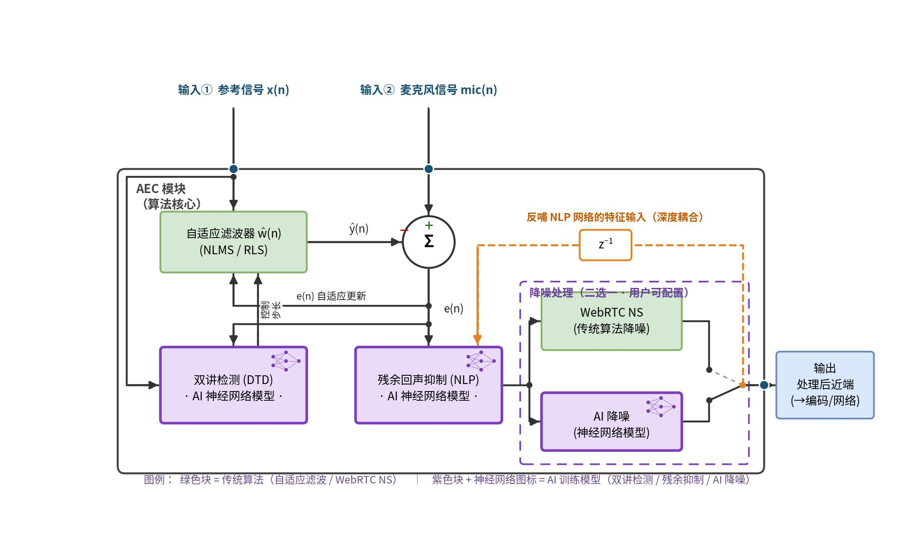

简体中文 | [English](README_EN.md)

# 基于 ESP32-S3 芯片的低功耗回声消除（AEC）解决方案

智能音箱、可视门铃、楼宇对讲、会议终端——只要设备需要"边放音、边收音"的全双工语音交互，扬声器信号就会经过空气路径回灌进麦克风，形成回声。回声消除（AEC）因此成为端侧语音链路中计算量最重、也最影响体验的一环。而在 ESP32-S3 这类端侧 MCU 上，工程师面对的是算力、内存、功耗的三重约束：AEC 占掉的每一个百分点 CPU，都是从唤醒词识别、网络协议栈和电池续航里挤出来的。

SeekAudio AEC 正是为这一场景设计的解决方案。在 ESP32-S3 实测中，它以约一半的算力开销，取得了明显更优的回声抑制效果。

## 一、方案总览

SeekAudio AEC 是一个面向嵌入式平台的声学回声消除库，对外呈现为简洁的"两路输入、一路输出"接口：输入远端参考信号与麦克风信号，输出去除回声后的近端语音。

- **接口即插即用**：API 与常见的 AFE 风格 AEC 前端接口兼容，已使用芯片自带方案的项目只需极少量代码改动即可切换；
- **固定处理规格**：16 kHz 采样率、32 ms 帧长（512 样点），参数简单，行为确定；
- **双档降噪可选**：创建时一个参数选择后级降噪引擎——标准 NS（基于 WebRTC NS，内存占用低）或 AI 降噪（神经网络模型，对非平稳噪声抑制更强）；
- **附带近端状态输出**：可选的四状态分类（静音 / 近端单讲 / 回声 / 双讲），按需惰性启用，不用则零开销；
- **闭源静态库交付**：以硬化后的 `.a` 库与单一头文件交付，依赖组件精确锁版，配套完整的 ESP32-S3 评测工程，客户可在自己的硬件上复现全部数据。

## 二、架构设计：传统信号处理与 AI 模型的深度耦合

SeekAudio AEC 采用"传统信号处理 + AI 神经网络"的混合架构（见框图，绿色块为传统算法，紫色块为 AI 训练模型）：

- **自适应滤波器（NLMS/RLS）** 承担线性回声估计——这是数学上最高效的部分，交给传统算法；
- **双讲检测（DTD）** 由 AI 神经网络模型实现，实时判别近端说话状态并控制滤波器步长，避免双讲期间滤波器发散、近端语音被误消；
- **残余回声抑制（NLP）** 同样由 AI 模型承担，清除线性滤波无法覆盖的非线性残余（扬声器失真、机壳振动等）；
- **末级降噪**在 WebRTC NS 与 AI 降噪之间由用户配置二选一。

这套架构最具差异化的设计，是图中橙色的 **z⁻¹ 跨帧反哺通路**：降噪级的输出经单帧延迟回送到 NLP 网络的特征输入端，使残余回声抑制与降噪两级形成跨帧的深度耦合。NLP 网络因此能"看到"下游降噪的实际行为，在抑制残余回声时与降噪级协同收敛，而不是两级各自为战。实测中 SeekAudio AEC 在远端单讲 ERLE 上高出基线约 12 dB，这条耦合通路是重要贡献者之一。

## 三、ESP32-S3 实测数据

评测采用两套国际公认的评估体系。其一是**微软 AEC Challenge**（ICASSP 国际声学回声消除挑战赛）：测试素材取自其公开数据集，场景划分（远端单讲 / 近端单讲 / 双讲）遵循其评测方法；其二是其配套的 **AECMOS 感知质量模型**——基于 ITU-T P.831 / P.808 主观评测体系的人工打分数据训练，输出 1–5 分的 MOS 感知分，是当前回声消除领域广泛使用的客观感知指标。回声抑制量另采用经典的 ERLE（回声返回损耗增益）指标。

以下数据在 ESP32-S3（240 MHz）上实测得到（多样本平均，16 kHz、32 ms 帧），对比基线为乐鑫 esp-sr 方案（锁定 v2.4.5，采用其默认内存布局）：

- **A1** = SeekAudio AEC + WebRTC NS　**A2** = SeekAudio AEC + AI 降噪
- **B1** = esp-sr FD-AEC + ns_pro（基线）　**B2** = esp-sr FD-AEC + NSNet2（基线）

注：ns_pro 即 esp-sr 集成的 WebRTC NS 传统降噪。因此 A1/B1 同为 WebRTC NS 降噪档、A2/B2 同为 AI 降噪档——两两对位公平，同档差距全部来自 AEC 本体。

| 指标 | A1 | A2 | B1（基线） | B2（基线） |
|---|---|---|---|---|
| CPU 平均负载 | **28.1%** | **37.8%** | 60.5% | 73.2% |
| 实时率 RTF（越高越好） | 3.56× | 2.64× | 1.65× | 1.37× |
| 相对基线算力节省 | **约 54%** | **约 48%** | — | — |
| 远端单讲 ERLE（dB，越高越好） | **21.5** | **29.4** | 9.7 | 17.8 |
| 残余回声（dBFS，越低越好） | **−46.6** | **−54.5** | −34.8 | −42.9 |
| AECMOS FE-ST Echo（回声抑制感知） | **4.04** | **4.04** | 3.10 | 3.62 |
| AECMOS NE-ST Other（近端自然度） | 3.46 | 3.21 | 3.68 | 3.77 |
| AECMOS DT Echo（双讲回声抑制） | **4.19** | 4.25 | 3.86 | 4.26 |
| AECMOS DT Other（双讲自然度） | 4.09 | 3.74 | 4.09 | 4.16 |
| AECMOS 综合（1–5，越高越好） | **3.85** | 3.80 | 3.48 | 3.77 |
| 内部 SRAM（KB） | 75.0 | 192.5 | 12.4 | 21.1 |
| PSRAM（KB） | 192.7 | 192.7 | 182.9 | 520.2 |
| Flash 模型分区（KB） | — | — | — | 1024 |

几点说明：

1. **算力减半，效果更优**。与同档降噪配置的基线相比（A1 对 B1、A2 对 B2），SeekAudio AEC 的 CPU 负载约为基线的一半，同时远端单讲 ERLE 高出约 12 dB、残余回声低 8–12 dBFS，AECMOS 回声类分项与综合分同步领先。
2. **AECMOS 分项如实呈现取舍**。Echo 分项衡量回声残留（越高回声越少），Other 分项衡量近端语音的自然度。A 组在 Echo 类分项全面领先；Other 类分项 B 组持平或略优（最多 0.6 分）——这是强抑制与保守处理之间的风格取舍，且 B2 为此付出约两倍算力与 1 MB 模型分区，综合分仍为 A 组领先。
3. **实时性充裕**。四组配置的单帧最大处理耗时均远小于 32 ms 帧预算，实测破帧率为 0；SeekAudio 配置的实时率余量（2.6–3.6 倍）显著更大。
4. **双讲不"吃"近端**。双讲场景下 AECMOS DT Echo 达 4.19/4.25 分，回声被抑制的同时近端语音得到保护。
5. **内存布局透明可比**。A 组将核心处理数据置于内部 SRAM 以换取速度，B 组保持 esp-sr 默认的 PSRAM 布局；按总内存计，A1 约 268 KB，B2 约 541 KB 外加 1 MB Flash 模型分区。

## 四、对 AI 玩具开发者意味着什么

当前用 ESP32-S3 做 AI 对话玩具的团队，几乎都会在语音前端撞上同一堵墙：AEC、降噪、语音唤醒、Wi-Fi/蓝牙协议栈和业务逻辑全部挤在一颗芯片上。SeekAudio AEC 在这个场景下带来的，是能直接拉开与竞品差距的几项能力：

1. **省出 32–35 个百分点的单核 CPU，换来整机稳定**。同档配置下 CPU 负载从 60.5%/73.2% 降到 28.1%/37.8%，约三分之一颗单核被释放出来。这些余量留给 Wi-Fi/蓝牙协议栈、唤醒引擎和业务逻辑，玩具在联网、对话、动作并发时不再因算力见顶而卡顿、断连或重启——而稳定性正是决定 AI 玩具退货率的第一因素。
2. **孩子可以随时打断玩具说话**。AI 玩具的核心交互是全双工对话：玩具播报时，孩子的插话必须被听见。双讲场景 AECMOS DT Echo 达 4.19/4.25 分——回声被压住的同时，近端童声得到保护，打断（barge-in）体验自然流畅。
3. **送往云端的音频更干净，大模型更少"听错"**。远端单讲 ERLE 高出基线约 12 dB、残余回声低 8–12 dBFS，玩具喇叭自己的声音被更彻底地从上行音频中剔除，云端 ASR 与大模型的识别准确率直接受益。
4. **工业设计不再被声学绑架**。回声消除能力弱的方案，常要靠把喇叭和麦克风的物理距离拉远来"硬扛"回声，玩具的外形因此受限。更强的 AEC 允许喇叭与麦克风靠得更近，外形、尺寸、结构的创新空间显著放大。
5. **单麦即可，不必为弥补前端质量加第二颗麦**。esp-sr 体系下提升拾音质量的标准路径是双麦 BSS——官方基准显示全双工场景下该管线 CPU 占用高达单核 81%–93%，还要多一颗麦克风的 BOM，并满足双麦间距 4–6.5 cm、水平轴线布置的结构约束，这对小体积异形玩具几乎是外形否决项。SeekAudio AEC 单麦实测 ERLE 21.5/29.4 dB、CPU 仅 28%–38%，对以近场交互为主的 AI 玩具，一颗麦克风即可交付完整体验——BOM、CPU、结构设计三头都省。
6. **实打实的功耗优势，还留了"降频"这张牌**。按乐鑫数据手册典型电流估算，芯片数字部分平均电流可省约 13 mA（约 23%，估算依据见文末注）；更重要的是 2.6–3.6 倍的实时余量允许把主频降到 160 MHz 继续压低功耗——基线 B2（RTF 1.37×）在 160 MHz 下已无法实时运行，根本没有这个选项。

这些优势同样适用于智能音箱与带屏语音助手、可视门铃与楼宇对讲、会议终端与话务设备、车载与手持对讲终端——一切在 ESP32-S3 等资源受限平台上做全双工语音的产品。

## 五、集成与交付

- **一行创建**：`seekaudio_aec_create("MR", type)` 即完成初始化，逐帧调用 `seekaudio_aec_process()` 处理；
- **接口兼容**：与 AFE 风格 AEC 接口对齐，存量项目切换成本低；
- **版本工程化**：依赖组件精确锁版交付，杜绝第三方组件漂移引入的 ABI 风险；跨 ESP-IDF 版本兼容（5.3–5.5 实测验证）；
- **可复现评测**：完整的四配置对比评测工程与自动化报告工具已开源（即本仓库），全部对比数据可在客户自己的 ESP32-S3 硬件上一键复跑。

欢迎联系我们（[https://www.seekaudio.cn/](https://www.seekaudio.cn/)）获取评估库与测试工程，在您自己的硬件与业务音频上验证以上全部数据。

---

*测试条件：ESP32-S3 @ 240 MHz，16 kHz 采样，32 ms/帧；素材取自微软 AEC Challenge 公开数据集，多样本平均；对比基线 esp-sr v2.4.5（默认配置与内存布局）、esp-dsp v1.8.0。功耗估算基于乐鑫《ESP32-S3 系列数据手册》v2.2 表 5-9 典型电流值（Modem-sleep 模式、外设时钟关闭），非实测值，且不含 Wi-Fi/蓝牙射频功耗。本文数据均来自 SeekAudio AEC 评测报告 v1.0（2026-07）；评测工程即本仓库，评测库基线为提交 `ca75b3d`（此后的库优化不体现于本文数据）。*
