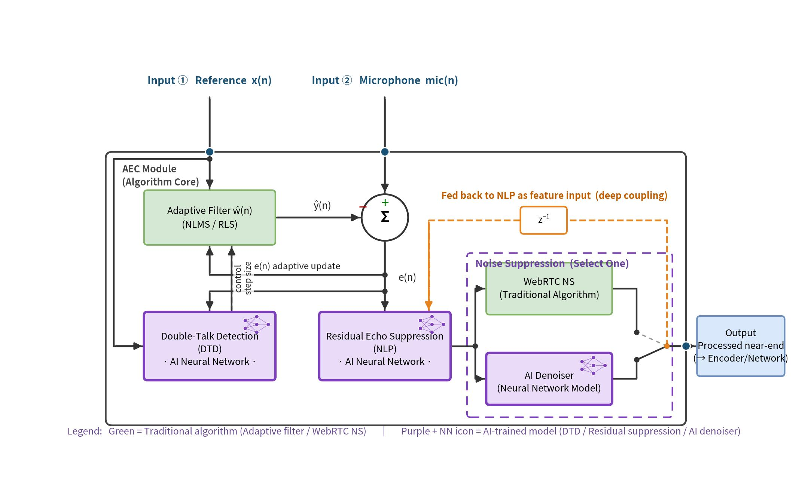

[简体中文](README.md) | English

# A Low-Power Acoustic Echo Cancellation (AEC) Solution for the ESP32-S3

Smart speakers, video doorbells, building intercoms, conference terminals — whenever a device needs full-duplex voice interaction ("play and listen at the same time"), the loudspeaker signal travels through the air back into the microphone and becomes echo. Acoustic echo cancellation (AEC) is therefore both the most compute-hungry and the most experience-critical stage of an embedded voice pipeline. And on an edge MCU like the ESP32-S3, engineers face a triple constraint of compute, memory and power: every percentage point of CPU consumed by AEC is taken away from wake-word detection, the network stack, and battery life.

SeekAudio AEC was designed for exactly this scenario. In on-device measurements on the ESP32-S3, it delivers clearly better echo suppression at roughly half the compute cost.

## 1. Solution overview

SeekAudio AEC is an acoustic echo cancellation library for embedded platforms with a simple "two inputs, one output" interface: feed it the far-end reference signal and the microphone signal, and it outputs near-end speech with the echo removed.

- **Drop-in API**: the API is compatible with common AFE-style AEC front-end interfaces; projects already using the chip vendor's solution can switch with minimal code changes;
- **Fixed processing format**: 16 kHz sample rate, 32 ms frames (512 samples) — few parameters, deterministic behavior;
- **Two selectable noise-suppression tiers**: a single parameter at creation time selects the post NS engine — standard NS (based on WebRTC NS, low memory footprint) or AI noise reduction (neural model, stronger on non-stationary noise);
- **Optional near-end state output**: a four-state classifier (silence / near-end single-talk / echo / double-talk), lazily enabled on demand with zero overhead when unused;
- **Closed-source static library delivery**: shipped as a hardened `.a` library with a single header, with exact-version-pinned dependencies and a complete ESP32-S3 benchmark project so customers can reproduce every number on their own hardware.

## 2. Architecture: deep coupling of classic signal processing and AI models

SeekAudio AEC uses a hybrid "classic signal processing + AI neural network" architecture (see the diagram: green blocks are classic algorithms, purple blocks are trained AI models):

- The **adaptive filter (NLMS/RLS)** performs linear echo estimation — the part where classic algorithms are mathematically most efficient;
- **Double-talk detection (DTD)** is implemented by an AI neural model that tracks the near-end speaking state in real time and controls the filter step size, preventing filter divergence and near-end speech being cancelled during double-talk;
- **Residual echo suppression (NLP)** is likewise handled by an AI model, removing the nonlinear residual that linear filtering cannot cover (loudspeaker distortion, enclosure vibration, etc.);
- The **final noise-suppression stage** is user-configurable between WebRTC NS and AI noise reduction.

The most differentiating design is the orange **z⁻¹ cross-frame feedback path** in the diagram: the output of the noise-suppression stage is fed back, with a one-frame delay, into the feature input of the NLP network, deeply coupling the residual-echo-suppression and noise-suppression stages across frames. The NLP network can therefore "see" the actual behavior of the downstream denoiser and converge jointly with it, instead of the two stages acting independently. In measurements, SeekAudio AEC scores roughly 12 dB higher FE single-talk ERLE than the baseline, and this coupling path is one of the main contributors.

## 3. Measured results on the ESP32-S3

The evaluation uses two internationally recognized frameworks. The first is the **Microsoft AEC Challenge** (the ICASSP acoustic echo cancellation challenge): the test material comes from its public dataset and the scene partitioning (far-end single-talk / near-end single-talk / double-talk) follows its methodology. The second is its companion **AECMOS perceptual model** — trained on human ratings collected under the ITU-T P.831 / P.808 subjective-testing framework, outputting a 1–5 MOS score; it is the objective perceptual metric most widely used in the AEC field. Echo suppression is additionally quantified with the classic ERLE (echo return loss enhancement) metric.

The numbers below were measured on an ESP32-S3 (240 MHz), multi-sample averages at 16 kHz with 32 ms frames. The comparison baseline is Espressif's esp-sr solution (pinned to v2.4.5, with its default memory placement):

- **A1** = SeekAudio AEC + WebRTC NS  **A2** = SeekAudio AEC + AI noise reduction
- **B1** = esp-sr FD-AEC + ns_pro (baseline)  **B2** = esp-sr FD-AEC + NSNet2 (baseline)

Note: ns_pro is esp-sr's built-in WebRTC NS classic denoiser. A1/B1 therefore share the WebRTC NS tier and A2/B2 share the AI tier — a like-for-like pairing where same-tier differences come entirely from the AEC itself.

| Metric | A1 | A2 | B1 (baseline) | B2 (baseline) |
|---|---|---|---|---|
| CPU load, avg | **28.1%** | **37.8%** | 60.5% | 73.2% |
| Real-time factor (higher is better) | 3.56× | 2.64× | 1.65× | 1.37× |
| Compute saved vs baseline | **~54%** | **~48%** | — | — |
| FE single-talk ERLE (dB, higher is better) | **21.5** | **29.4** | 9.7 | 17.8 |
| Residual echo (dBFS, lower is better) | **−46.6** | **−54.5** | −34.8 | −42.9 |
| AECMOS FE-ST Echo | **4.04** | **4.04** | 3.10 | 3.62 |
| AECMOS NE-ST Other | 3.46 | 3.21 | 3.68 | 3.77 |
| AECMOS DT Echo | **4.19** | 4.25 | 3.86 | 4.26 |
| AECMOS DT Other | 4.09 | 3.74 | 4.09 | 4.16 |
| AECMOS composite (1–5, higher is better) | **3.85** | 3.80 | 3.48 | 3.77 |
| Internal SRAM (KB) | 75.0 | 192.5 | 12.4 | 21.1 |
| PSRAM (KB) | 192.7 | 192.7 | 182.9 | 520.2 |
| Flash model partition (KB) | — | — | — | 1024 |

Notes:

1. **Half the compute, better results.** Against the same-tier baseline (A1 vs B1, A2 vs B2), SeekAudio AEC runs at about half the CPU load while scoring ~12 dB higher FE single-talk ERLE, 8–12 dBFS lower residual echo, and leading on the AECMOS echo sub-scores and composite.
2. **The AECMOS sub-scores show the trade-off honestly.** Echo sub-scores measure residual echo (higher = less echo); Other sub-scores measure near-end naturalness. Group A leads across all Echo sub-scores; group B is on par or slightly ahead (by at most 0.6) on the Other sub-scores — a style trade-off between aggressive suppression and conservative processing, for which B2 pays roughly 2× the compute plus a 1 MB model partition. The composite still favors group A.
3. **Ample real-time margin.** All four configs keep per-frame maximum processing time far below the 32 ms budget with a measured frame-miss rate of 0; the SeekAudio configs have a much larger real-time margin (2.6–3.6×).
4. **Double-talk does not "eat" near-end speech.** AECMOS DT Echo reaches 4.19/4.25 — echo is suppressed while near-end speech is protected.
5. **Transparent, comparable memory placement.** Group A places core processing data in internal SRAM to trade for speed; group B keeps esp-sr's default PSRAM placement. In total memory, A1 is ~268 KB while B2 is ~541 KB plus a 1 MB flash model partition.

## 4. What this means for AI toy developers

Teams building AI conversational toys on the ESP32-S3 almost always hit the same wall in the voice front end: AEC, noise suppression, wake word, the Wi-Fi/Bluetooth stack and application logic all squeezed onto one chip. In this scenario, SeekAudio AEC brings several capabilities that directly separate a product from its competitors:

1. **32–35 percentage points of a single core freed, converted into whole-device stability.** At the same NS tier, CPU load drops from 60.5%/73.2% to 28.1%/37.8% — about a third of a core released. That headroom goes to the Wi-Fi/BT stack, the wake engine and application logic, so the toy no longer stutters, drops connections or reboots when networking, talking and moving at the same time — and stability is the number-one driver of AI toy return rates.
2. **The child can interrupt the toy at any time.** The core interaction of an AI toy is full-duplex dialogue: while the toy is speaking, the child's interjection must be heard. In double-talk, AECMOS DT Echo reaches 4.19/4.25 — echo is held down while the child's voice is preserved, making barge-in natural and fluid.
3. **Cleaner audio to the cloud; the LLM mishears less.** With ~12 dB higher FE single-talk ERLE and 8–12 dBFS lower residual echo, the toy's own loudspeaker output is removed far more thoroughly from the uplink, directly benefiting cloud ASR and LLM accuracy.
4. **Industrial design is no longer hostage to acoustics.** Solutions with weak echo cancellation often resort to physically separating the speaker and microphone to "brute-force" the echo down, constraining the toy's form. Stronger AEC lets the speaker and microphone sit close together, greatly expanding the freedom of shape, size and structure.
5. **One microphone is enough — no need to walk the triple-cost path of adding a second mic.** In the esp-sr ecosystem, the standard route to better pickup quality is dual-mic BSS — official benchmarks show that pipeline consuming 81%–93% of a single core in full-duplex scenarios, on top of an extra microphone's BOM and the structural constraints of 4–6.5 cm mic spacing on a horizontal axis, which is nearly a veto on small, unconventional toy forms. SeekAudio AEC measures 21.5/29.4 dB ERLE on a single mic at only 28%–38% CPU: for AI toys centered on near-field interaction, one microphone delivers the full experience — saving BOM, CPU and an entire mic-array design-and-calibration effort.
6. **A real power advantage, plus the "downclocking" card.** Estimated from typical currents in the Espressif datasheet, the chip's digital-domain average current drops by about 13 mA (~23%; see the note at the end). More importantly, the 2.6–3.6× real-time margin allows dropping the clock to 160 MHz for further savings — baseline B2 (RTF 1.37×) cannot run in real time at 160 MHz at all.

These advantages apply equally to smart speakers and voice assistants with displays, video doorbells and building intercoms, conference terminals, and vehicle-mounted or handheld intercoms — any full-duplex voice product on resource-constrained platforms like the ESP32-S3.

## 5. Integration and delivery

- **One-line creation**: `seekaudio_aec_create("MR", type)` initializes the engine; call `seekaudio_aec_process()` per frame;
- **Compatible interface**: aligned with AFE-style AEC interfaces for low migration cost in existing projects;
- **Version engineering**: dependencies pinned to exact versions to eliminate ABI drift from third-party components; cross-IDF compatibility (verified on 5.3–5.5);
- **Reproducible benchmark**: the complete four-config benchmark project and automated report tool are open source (this repository); every comparison number can be re-run on the customer's own ESP32-S3 hardware with one flash cycle.

We welcome you to request the evaluation library and test project ([https://www.seekaudio.cn/](https://www.seekaudio.cn/)) and verify all of the above on your own hardware and your own audio.

---

*Test conditions: ESP32-S3 @ 240 MHz, 16 kHz sampling, 32 ms/frame; material from the public Microsoft AEC Challenge dataset, multi-sample averaged; baseline esp-sr v2.4.5 (default configuration and memory placement), esp-dsp v1.8.0. The power estimate is based on typical current values in Espressif's "ESP32-S3 Series Datasheet" v2.2, Table 5-9 (modem-sleep mode, peripheral clocks disabled); it is an estimate, not a measurement, and excludes Wi-Fi/Bluetooth RF power. All data in this article come from the SeekAudio AEC Evaluation Report v1.0 (2026-07); the benchmark project is this repository, with library baseline at commit `ca75b3d` (later library optimizations are not reflected in these numbers).*
