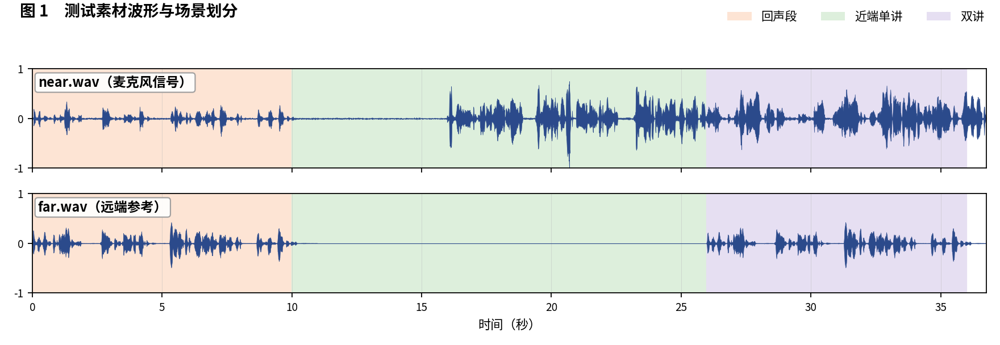
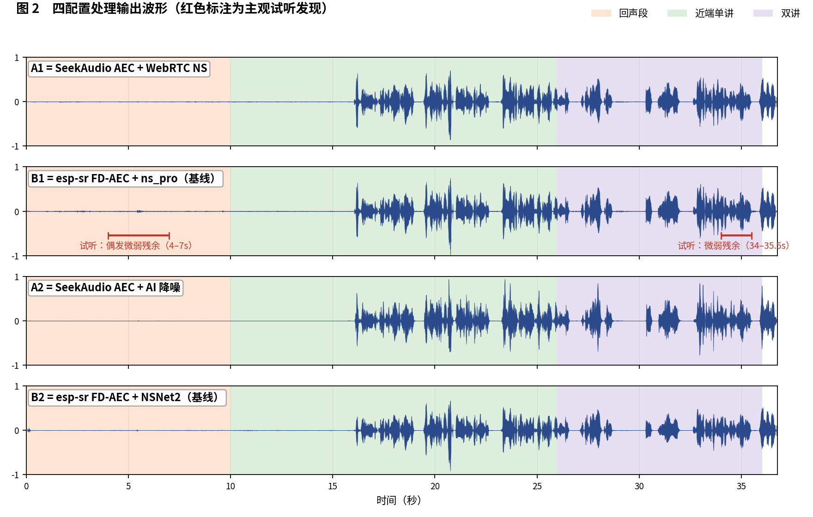
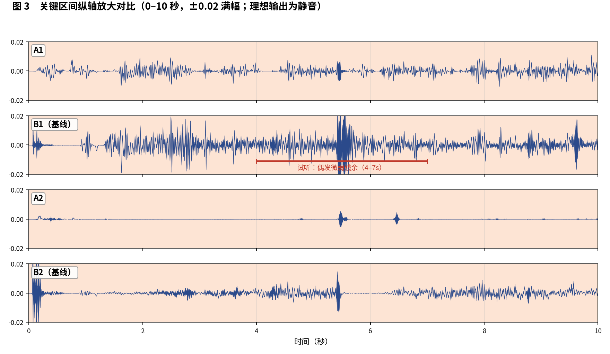

简体中文 | [English](README_EN.md)

# SeekAudio AEC 测试用例 1

**回声 / 近端 / 双讲全场景对比** · ESP32-S3 实测 · 主观 + 客观双重评估

## 一、素材与场景

实录测试素材，约 36.8 秒。 人工试听标注场景边界如下：

- **回声段**：0–10 秒
- **近端单讲**：10–26 秒
- **双讲**：26–36 秒

四个被测配置与[主文章](../../article/README.md)一致（A1/B1 同为 WebRTC NS 降噪档、A2/B2 同为 AI 降噪档，两两对位公平）。四路输出均在 ESP32-S3（240 MHz，16 kHz，32 ms 帧）上实际运行产生。

**本用例原始输出文件**（点击即可下载试听 / 查看）：

| 文件 | 说明 |
|---|---|
| [near.wav](../../../output_dir/case1/near.wav) / [far.wav](../../../output_dir/case1/far.wav) | 测试素材（麦克风 / 远端参考） |
| [a1.wav](../../../output_dir/case1/a1.wav) [b1.wav](../../../output_dir/case1/b1.wav) [a2.wav](../../../output_dir/case1/a2.wav) [b2.wav](../../../output_dir/case1/b2.wav) | 四配置在 ESP32-S3 上的处理输出 |
| [log.txt](../../../output_dir/case1/log.txt) | 设备串口日志 |
| [aec_report.txt](../../../output_dir/case1/aec_report.txt) / [aec_report_en.txt](../../../output_dir/case1/aec_report_en.txt) | 完整自动化报告（中 / 英） |

## 二、主观评估：眼见为实，耳听为实







**试听结论（佩戴耳机逐段对听，欢迎下载上方 wav 亲自验证）：**

- **B1**：回声段第 4–7 秒偶尔可以听到很小的残余回声；双讲段第 34–35.5 秒也能听到很小的残余回声；
- **A1、A2、B2**：全程试听未发现可察觉的残余回声或语音损伤。

## 三、客观数据

指标体系与主文章一致（微软 AEC Challenge 方法 + AECMOS + ERLE），由 [aec_report.py](../../../tools/aec_report.py) 自动生成；加粗表示同档对比（A1 对 B1、A2 对 B2）中的占优方。

**设备端计算性能**

| 指标 | A1 | A2 | B1（基线） | B2（基线） |
|---|---|---|---|---|
| CPU 平均负载（%） | **26.6** | **36.9** | 58.2 | 70.9 |
| 实时率 RTF（越高越好） | **3.75×** | **2.71×** | 1.72× | 1.41× |

**回声抑制与感知质量**

| 指标 | A1 | A2 | B1（基线） | B2（基线） |
|---|---|---|---|---|
| FE-ST ERLE（dB，越高越好） | **24.3** | **43.3** | 19.7 | 25.1 |
| 残余回声（dBFS，越低越好） | **-53.5** | **-72.4** | -48.9 | -54.3 |
| NE-ST 近端相关度 | 0.997 | 0.898 | 0.997 | **0.984** |
| 链路延迟（ms） | **64** | 96 | 70 | **64** |
| AECMOS FE-ST Echo | **3.97** | 3.82 | 2.78 | **4.03** |
| AECMOS NE-ST Other | 3.85 | 3.93 | **4.24** | **4.14** |
| AECMOS DT Echo | **4.71** | 4.37 | 4.27 | **4.53** |
| AECMOS DT Other | **4.46** | 4.22 | 4.15 | **4.39** |
| AECMOS 综合 | **4.25** | 4.08 | 3.86 | **4.27** |

## 四、分析与判定

主客观互相印证：B1 的可闻残余对应其 FE-ST Echo 仅 2.78 分（四者中唯一跌出 3.8 分档）、ERLE 最低（19.7 dB）、残余最高（−48.9 dBFS）；双讲瞬时残余对应 DT Echo 4.27 为四者最低。A2 主观全程无回声，与 −72.4 dBFS（听阈之下）吻合。

**判定：A1 对 B1 —— A1 胜**，算力节省 54% 的同时主客观全面领先。**A2 对 B2 —— 各有胜场**：A2 在算力、抑制深度、总内存领先；B2 的 AECMOS 分项略高 0.1–0.2 分、延迟少 32 ms，主观两者均无可察觉问题。

**复现本用例**（按仓库主页 README 完成编译烧写运行，保存串口日志为 log.txt，解包 littlefs 后与 AECMOS 模型放入同一目录，执行）：

```bash
python aec_report.py --echo 0:10 --near 10:26 --dt 26:36
```

---

*测试条件：ESP32-S3 @ 240 MHz，16 kHz，32 ms/帧；对比基线 esp-sr v2.4.5、esp-dsp v1.8.0；波形图由 make_figs_v2.py 生成；评测库基线为提交 `ca75b3d`，此后的库优化不体现于本报告。*
