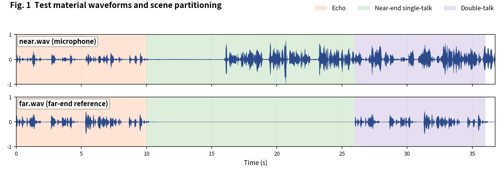
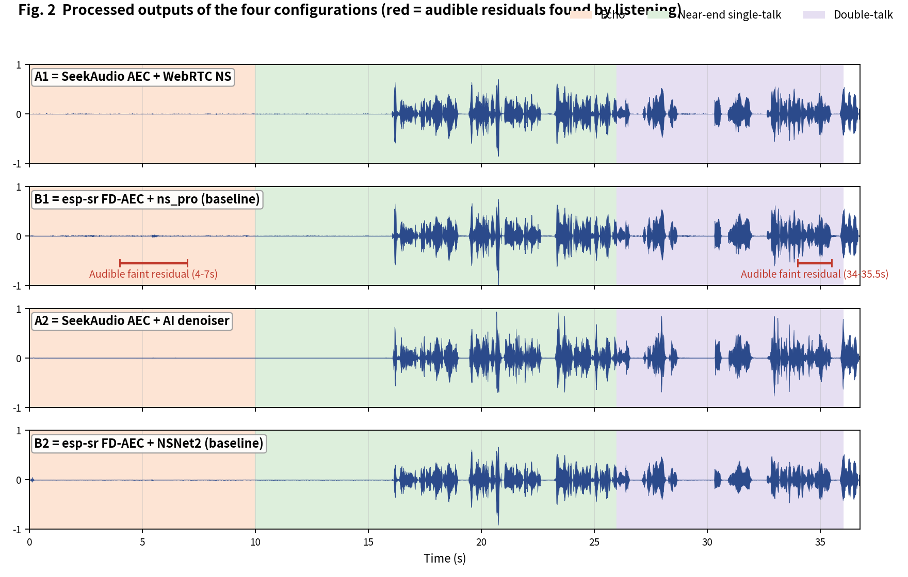
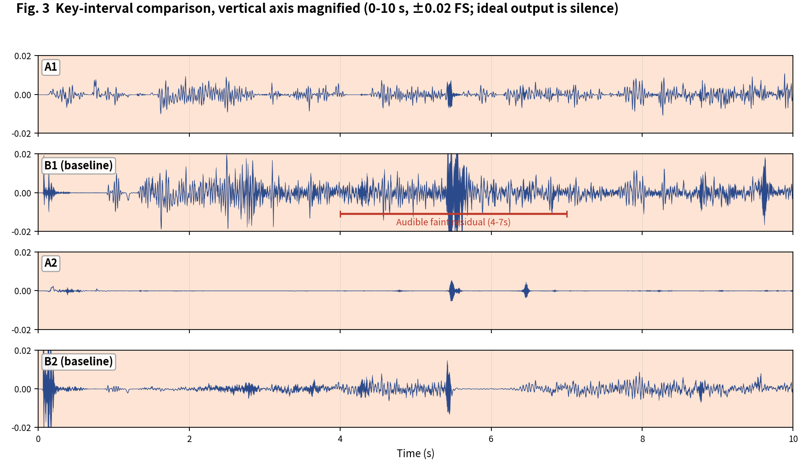

[简体中文](README.md) | English

# SeekAudio AEC Test Case 1

**Full-scenario comparison: echo / near-end / double-talk** · measured on ESP32-S3 · subjective + objective evaluation

## 1. Material and scenes

Recorded test clip, ~36.8 s. Scene boundaries were annotated by listening:

- **Echo**: 0-10 s
- **Near-end single-talk**: 10-26 s
- **Double-talk**: 26-36 s

The four configurations match the [main article](../../article/README_EN.md) (A1/B1 share the WebRTC NS tier, A2/B2 share the AI tier - a like-for-like pairing). All outputs were produced on an ESP32-S3 (240 MHz, 16 kHz, 32 ms frames).

**Raw output files of this case** (click to download / listen / view):

| File | Description |
|---|---|
| [near.wav](../../../output_dir/case1/near.wav) / [far.wav](../../../output_dir/case1/far.wav) | Test material (microphone / far-end reference) |
| [a1.wav](../../../output_dir/case1/a1.wav) [b1.wav](../../../output_dir/case1/b1.wav) [a2.wav](../../../output_dir/case1/a2.wav) [b2.wav](../../../output_dir/case1/b2.wav) | The four configurations' outputs on the ESP32-S3 |
| [log.txt](../../../output_dir/case1/log.txt) | Device serial log |
| [aec_report.txt](../../../output_dir/case1/aec_report.txt) / [aec_report_en.txt](../../../output_dir/case1/aec_report_en.txt) | Full automated report (CN / EN) |

## 2. Subjective evaluation: see it, hear it







**Listening verdict (headphones, segment-by-segment A/B; download the WAVs above and verify yourself):**

- **B1**: faint residual echo occasionally audible at 4-7 s in the echo segment, and again at 34-35.5 s in double-talk;
- **A1, A2, B2**: no perceivable residual echo or speech damage anywhere.

## 3. Objective data

Metrics follow the main article (Microsoft AEC Challenge methodology + AECMOS + ERLE), computed by [aec_report_en.py](../../../tools/aec_report_en.py) automatically; bold marks the winner within each same-tier pair (A1 vs B1, A2 vs B2).

**On-device compute**

| Metric | A1 | A2 | B1 (baseline) | B2 (baseline) |
|---|---|---|---|---|
| CPU load, avg (%) | **26.6** | **36.9** | 58.2 | 70.9 |
| Real-time factor (higher is better) | **3.75×** | **2.71×** | 1.72× | 1.41× |

**Echo suppression and perceptual quality**

| Metric | A1 | A2 | B1 (baseline) | B2 (baseline) |
|---|---|---|---|---|
| FE-ST ERLE (dB, higher is better) | **24.3** | **43.3** | 19.7 | 25.1 |
| Residual echo (dBFS, lower is better) | **-53.5** | **-72.4** | -48.9 | -54.3 |
| NE-ST correlation | 0.997 | 0.898 | 0.997 | **0.984** |
| Path delay (ms) | **64** | 96 | 70 | **64** |
| AECMOS FE-ST Echo | **3.97** | 3.82 | 2.78 | **4.03** |
| AECMOS NE-ST Other | 3.85 | 3.93 | **4.24** | **4.14** |
| AECMOS DT Echo | **4.71** | 4.37 | 4.27 | **4.53** |
| AECMOS DT Other | **4.46** | 4.22 | 4.15 | **4.39** |
| AECMOS composite | **4.25** | 4.08 | 3.86 | **4.27** |

## 4. Analysis and verdict

Subjective and objective agree: B1's audible residual matches its FE-ST Echo of only 2.78 (the only config below the 3.8 tier), the lowest ERLE (19.7 dB) and the highest residual (-48.9 dBFS); its transient double-talk residual matches the lowest DT Echo (4.27). A2 being subjectively echo-free matches -72.4 dBFS, below audibility.

**Verdict: A1 vs B1 - A1 wins**, leading across the board while saving 54% compute. **A2 vs B2 - split decision**: A2 leads on compute, suppression depth and total memory; B2 scores 0.1-0.2 higher on AECMOS sub-metrics with 32 ms less delay; subjectively both are clean.

**Reproducing this case** (build/flash/run per the repo README, save the serial log as log.txt, unpack littlefs, add the AECMOS model to the same folder, then run):

```bash
python aec_report_en.py --echo 0:10 --near 10:26 --dt 26:36
```

---

*Test conditions: ESP32-S3 @ 240 MHz, 16 kHz, 32 ms/frame; baselines esp-sr v2.4.5, esp-dsp v1.8.0; figures generated by make_figs_v2.py; library baseline is commit `ca75b3d` - later library optimizations are not reflected in this report.*
