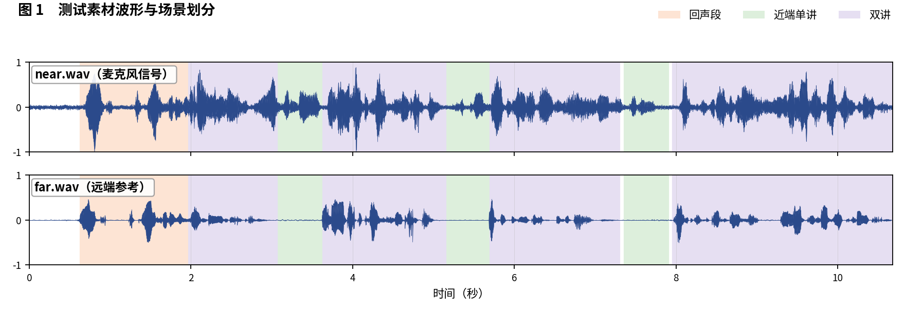
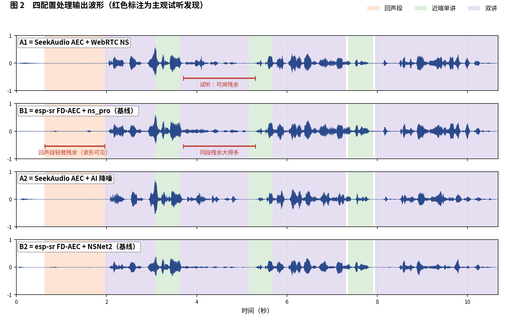
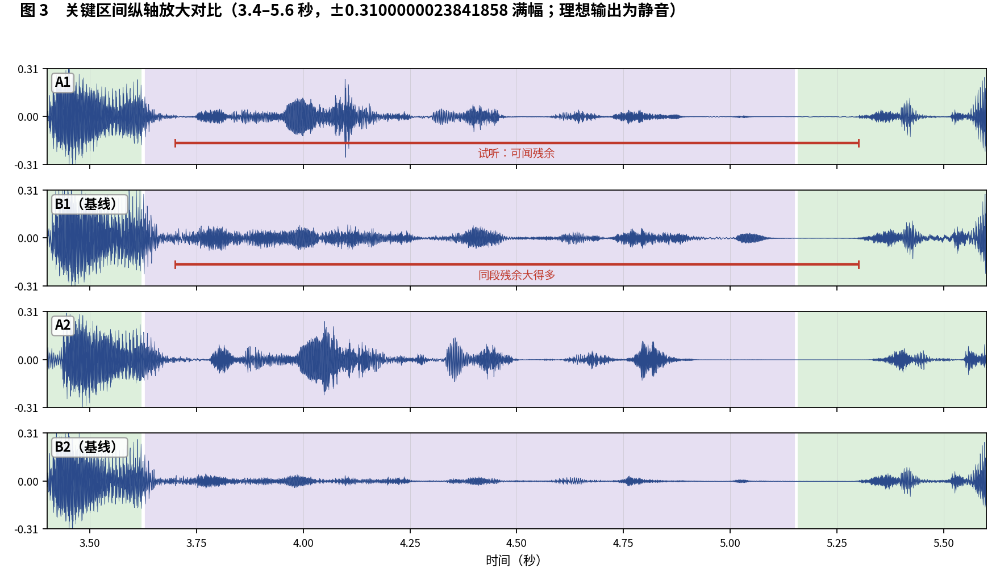

简体中文 | [English](README_EN.md)

# SeekAudio AEC 测试用例 10

**密集双讲：基线 FE 感知分崩盘的用例** · ESP32-S3 实测 · 主观 + 客观双重评估

## 一、素材与场景

素材取自微软 AEC Challenge 数据集：near/far 分别为 `uNwyJZXU00eLpxsYOkGEFA_doubletalk_with_movement` 的 `_mic.wav` 与 `_lpb.wav`（密集双讲）。 人工试听标注场景边界如下：

- **回声段**：0.63–1.96 秒
- **近端单讲**：3.08–3.62 秒，5.16–5.7 秒，7.36–7.91 秒
- **双讲**：1.97–3.07 秒，3.63–5.15 秒，5.7–7.3 秒，7.96–10.68 秒

四个被测配置与[主文章](../../article/README.md)一致（A1/B1 同为 WebRTC NS 降噪档、A2/B2 同为 AI 降噪档，两两对位公平）。四路输出均在 ESP32-S3（240 MHz，16 kHz，32 ms 帧）上实际运行产生。

**本用例原始输出文件**（点击即可下载试听 / 查看）：

| 文件 | 说明 |
|---|---|
| [near.wav](../../../output_dir/case10/near.wav) / [far.wav](../../../output_dir/case10/far.wav) | 测试素材（麦克风 / 远端参考） |
| [a1.wav](../../../output_dir/case10/a1.wav) [b1.wav](../../../output_dir/case10/b1.wav) [a2.wav](../../../output_dir/case10/a2.wav) [b2.wav](../../../output_dir/case10/b2.wav) | 四配置在 ESP32-S3 上的处理输出 |
| [log.txt](../../../output_dir/case10/log.txt) | 设备串口日志 |
| [aec_report.txt](../../../output_dir/case10/aec_report.txt) / [aec_report_en.txt](../../../output_dir/case10/aec_report_en.txt) | 完整自动化报告（中 / 英） |

## 二、主观评估：眼见为实，耳听为实







**试听结论（佩戴耳机逐段对听，欢迎下载上方 wav 亲自验证）：**

- **回声段（0.63–1.96 秒）**：B1 有一点点残余，波形上就能看出来；
- **3.7–5.3 秒双讲段**：A1 和 B1 都消不干净这段回声，但从波形看 **B1 的残余大很多**；
- 同一段里 **B2 的表现却优于 A2**——如实记录。

## 三、客观数据

指标体系与主文章一致（微软 AEC Challenge 方法 + AECMOS + ERLE），由 [aec_report.py](../../../tools/aec_report.py) 自动生成；加粗表示同档对比（A1 对 B1、A2 对 B2）中的占优方。

**设备端计算性能**

| 指标 | A1 | A2 | B1（基线） | B2（基线） |
|---|---|---|---|---|
| CPU 平均负载（%） | **29.1** | **38.5** | 61.5 | 74.4 |
| 实时率 RTF（越高越好） | **3.43×** | **2.60×** | 1.62× | 1.34× |

**回声抑制与感知质量**

| 指标 | A1 | A2 | B1（基线） | B2（基线） |
|---|---|---|---|---|
| FE-ST ERLE（dB，越高越好） | **53.8** | **54.3** | 30.8 | 36.8 |
| 残余回声（dBFS，越低越好） | **-71.2** | **-71.7** | -48.2 | -54.2 |
| NE-ST 近端相关度 | 0.930 | 0.895 | **0.975** | **0.953** |
| 链路延迟（ms） | **64** | 96 | 70 | **64** |
| AECMOS FE-ST Echo | **4.60** | **4.58** | 1.38 | 1.35 |
| AECMOS NE-ST Other | 3.04 | 2.79 | **3.26** | **3.39** |
| AECMOS DT Echo | **3.90** | **4.01** | 3.29 | 3.79 |
| AECMOS DT Other | 3.73 | 3.34 | **4.08** | **4.13** |
| AECMOS 综合 | **3.82** | **3.68** | 3.00 | 3.17 |

## 四、分析与判定

本例基线的 FE-ST Echo **崩盘**：B1/B2 仅 1.38/1.35，A1/A2 为 4.60/4.58——十个用例中最大的感知分差；ERLE 同向（A 组 53.8/54.3 dB 对 B 组 30.8/36.8 dB）。你听到的 3.7–5.3 秒'B2 局部优于 A2'与整段统计并不矛盾：DT Echo 整段平均仍是 A2 4.01 对 B2 3.79——局部窗口与整段平均可以指向不同方向，这也是主观逐段试听的价值所在。

**判定：A 组大幅领先**（B 组 FE 感知分跌至 1.4 附近属不可用档）；B2 在 3.7–5.3 秒的局部优势与近端自然度分项如实保留在记录中。

**复现本用例**（按仓库主页 README 完成编译烧写运行，保存串口日志为 log.txt，解包 littlefs 后与 AECMOS 模型放入同一目录，执行）：

```bash
python aec_report.py --echo 0.63:1.96 --near 3.08:3.62,5.16:5.7,7.36:7.91 --dt 1.97:3.07,3.63:5.15,5.7:7.3,7.96:10.68
```

---

*测试条件：ESP32-S3 @ 240 MHz，16 kHz，32 ms/帧；对比基线 esp-sr v2.4.5、esp-dsp v1.8.0；波形图由 make_figs_v2.py 生成；评测库基线为提交 `ca75b3d`，此后的库优化不体现于本报告。*
