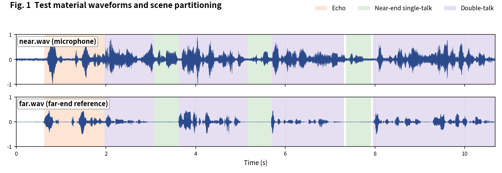
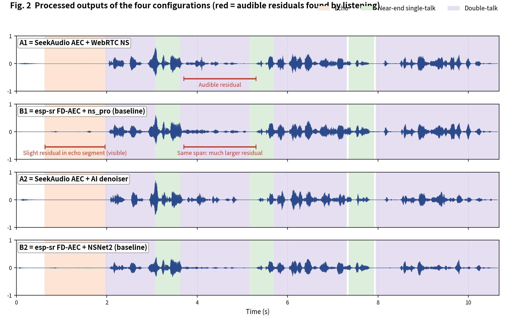
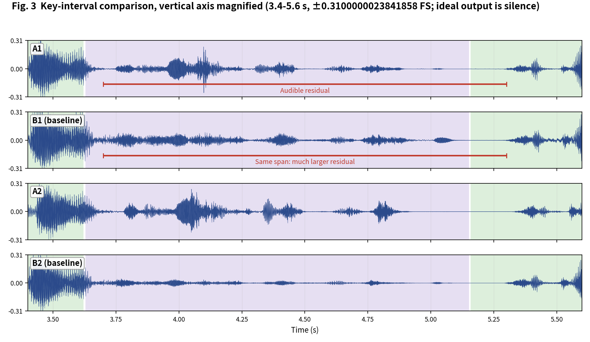

[简体中文](README.md) | English

# SeekAudio AEC Test Case 10

**Dense double-talk: the case where the baseline's FE perception score collapses** · measured on ESP32-S3 · subjective + objective evaluation

## 1. Material and scenes

Material from the Microsoft AEC Challenge dataset: near/far are the `_mic.wav` and `_lpb.wav` of `uNwyJZXU00eLpxsYOkGEFA_doubletalk_with_movement` (dense double-talk). Scene boundaries were annotated by listening:

- **Echo**: 0.63-1.96 s
- **Near-end single-talk**: 3.08-3.62 s, 5.16-5.7 s, 7.36-7.91 s
- **Double-talk**: 1.97-3.07 s, 3.63-5.15 s, 5.7-7.3 s, 7.96-10.68 s

The four configurations match the [main article](../../article/README_EN.md) (A1/B1 share the WebRTC NS tier, A2/B2 share the AI tier - a like-for-like pairing). All outputs were produced on an ESP32-S3 (240 MHz, 16 kHz, 32 ms frames).

**Raw output files of this case** (click to download / listen / view):

| File | Description |
|---|---|
| [near.wav](../../../output_dir/case10/near.wav) / [far.wav](../../../output_dir/case10/far.wav) | Test material (microphone / far-end reference) |
| [a1.wav](../../../output_dir/case10/a1.wav) [b1.wav](../../../output_dir/case10/b1.wav) [a2.wav](../../../output_dir/case10/a2.wav) [b2.wav](../../../output_dir/case10/b2.wav) | The four configurations' outputs on the ESP32-S3 |
| [log.txt](../../../output_dir/case10/log.txt) | Device serial log |
| [aec_report.txt](../../../output_dir/case10/aec_report.txt) / [aec_report_en.txt](../../../output_dir/case10/aec_report_en.txt) | Full automated report (CN / EN) |

## 2. Subjective evaluation: see it, hear it







**Listening verdict (headphones, segment-by-segment A/B; download the WAVs above and verify yourself):**

- **Echo segment (0.63-1.96 s)**: B1 leaves a slight residual, visible in the waveform;
- **3.7-5.3 s double-talk**: neither A1 nor B1 fully removes the echo, but **B1's residual is much larger** in the waveform;
- in that same span **B2 actually outperforms A2** - recorded as heard.

## 3. Objective data

Metrics follow the main article (Microsoft AEC Challenge methodology + AECMOS + ERLE), computed by [aec_report_en.py](../../../tools/aec_report_en.py) automatically; bold marks the winner within each same-tier pair (A1 vs B1, A2 vs B2).

**On-device compute**

| Metric | A1 | A2 | B1 (baseline) | B2 (baseline) |
|---|---|---|---|---|
| CPU load, avg (%) | **29.1** | **38.5** | 61.5 | 74.4 |
| Real-time factor (higher is better) | **3.43×** | **2.60×** | 1.62× | 1.34× |

**Echo suppression and perceptual quality**

| Metric | A1 | A2 | B1 (baseline) | B2 (baseline) |
|---|---|---|---|---|
| FE-ST ERLE (dB, higher is better) | **53.8** | **54.3** | 30.8 | 36.8 |
| Residual echo (dBFS, lower is better) | **-71.2** | **-71.7** | -48.2 | -54.2 |
| NE-ST correlation | 0.930 | 0.895 | **0.975** | **0.953** |
| Path delay (ms) | **64** | 96 | 70 | **64** |
| AECMOS FE-ST Echo | **4.60** | **4.58** | 1.38 | 1.35 |
| AECMOS NE-ST Other | 3.04 | 2.79 | **3.26** | **3.39** |
| AECMOS DT Echo | **3.90** | **4.01** | 3.29 | 3.79 |
| AECMOS DT Other | 3.73 | 3.34 | **4.08** | **4.13** |
| AECMOS composite | **3.82** | **3.68** | 3.00 | 3.17 |

## 4. Analysis and verdict

The baseline's FE-ST Echo **collapses** here: B1/B2 score only 1.38/1.35 vs A1/A2's 4.60/4.58 - the largest perception gap of the ten cases; ERLE agrees (group A 53.8/54.3 dB vs group B 30.8/36.8 dB). The 'B2 locally better than A2' heard at 3.7-5.3 s does not contradict the whole-segment statistics: averaged over the DT segments, DT Echo is still A2 4.01 vs B2 3.79 - a local window and a segment average can point different ways, which is precisely the value of segment-by-segment listening.

**Verdict: group A leads by a wide margin** (an FE perception score near 1.4 is in unusable territory); B2's local advantage at 3.7-5.3 s and its near-end naturalness sub-score are kept on the record as heard.

**Reproducing this case** (build/flash/run per the repo README, save the serial log as log.txt, unpack littlefs, add the AECMOS model to the same folder, then run):

```bash
python aec_report_en.py --echo 0.63:1.96 --near 3.08:3.62,5.16:5.7,7.36:7.91 --dt 1.97:3.07,3.63:5.15,5.7:7.3,7.96:10.68
```

---

*Test conditions: ESP32-S3 @ 240 MHz, 16 kHz, 32 ms/frame; baselines esp-sr v2.4.5, esp-dsp v1.8.0; figures generated by make_figs_v2.py; library baseline is commit `ca75b3d` - later library optimizations are not reflected in this report.*
