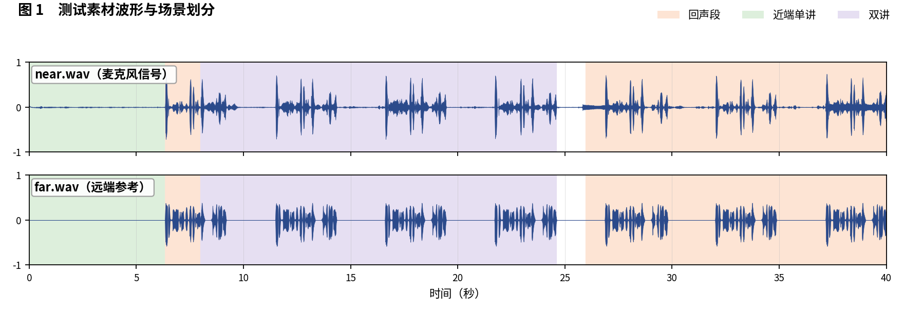
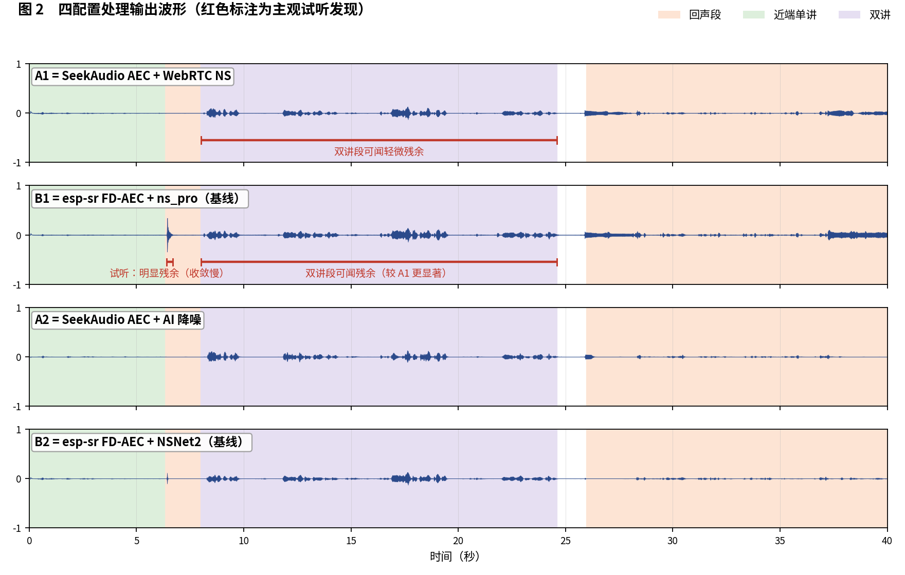
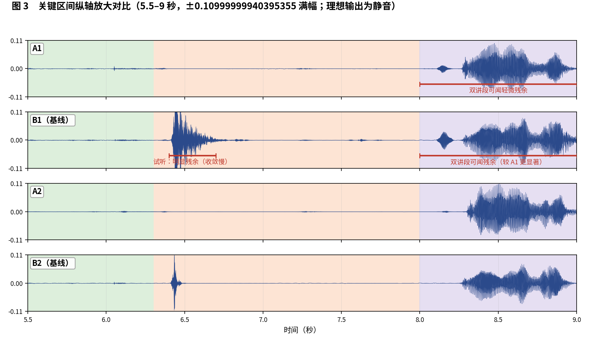

简体中文 | [English](README_EN.md)

# SeekAudio AEC 测试用例 2

**长双讲样本：收敛速度与双讲残余对比** · ESP32-S3 实测 · 主观 + 客观双重评估

## 一、素材与场景

实录测试素材，约 40 秒的长样本；开头为近端单讲，中段为长双讲，后段为回声。 人工试听标注场景边界如下：

- **回声段**：6–8 秒，26–40 秒
- **近端单讲**：0–6.3 秒
- **双讲**：8–24.6 秒

四个被测配置与[主文章](../../article/README.md)一致（A1/B1 同为 WebRTC NS 降噪档、A2/B2 同为 AI 降噪档，两两对位公平）。四路输出均在 ESP32-S3（240 MHz，16 kHz，32 ms 帧）上实际运行产生。

**本用例原始输出文件**（点击即可下载试听 / 查看）：

| 文件 | 说明 |
|---|---|
| [near.wav](../../../output_dir/case2/near.wav) / [far.wav](../../../output_dir/case2/far.wav) | 测试素材（麦克风 / 远端参考） |
| [a1.wav](../../../output_dir/case2/a1.wav) [b1.wav](../../../output_dir/case2/b1.wav) [a2.wav](../../../output_dir/case2/a2.wav) [b2.wav](../../../output_dir/case2/b2.wav) | 四配置在 ESP32-S3 上的处理输出 |
| [log.txt](../../../output_dir/case2/log.txt) | 设备串口日志 |
| [aec_report.txt](../../../output_dir/case2/aec_report.txt) / [aec_report_en.txt](../../../output_dir/case2/aec_report_en.txt) | 完整自动化报告（中 / 英） |

## 二、主观评估：眼见为实，耳听为实







**试听结论（佩戴耳机逐段对听，欢迎下载上方 wav 亲自验证）：**

- **B1**：第 6.4–6.7 秒残留非常明显的回声，波形上清晰可见——该段处于回声段开头，说明 B1 的收敛速度远慢于 A1；
- **A1、A2**：该段无可闻残余；**B2** 借 AI 降噪基本消除了这段残余，但仍有一点点；
- **双讲段（8–24.6 秒）**：A1 与 B1 都能听到残余回声，但 B1 的残余明显比 A1 更显著。

## 三、客观数据

指标体系与主文章一致（微软 AEC Challenge 方法 + AECMOS + ERLE），由 [aec_report.py](../../../tools/aec_report.py) 自动生成；加粗表示同档对比（A1 对 B1、A2 对 B2）中的占优方。

**设备端计算性能**

| 指标 | A1 | A2 | B1（基线） | B2（基线） |
|---|---|---|---|---|
| CPU 平均负载（%） | **27.6** | **37.8** | 60.1 | 72.8 |
| 实时率 RTF（越高越好） | **3.63×** | **2.64×** | 1.66× | 1.37× |

**回声抑制与感知质量**

| 指标 | A1 | A2 | B1（基线） | B2（基线） |
|---|---|---|---|---|
| FE-ST ERLE（dB，越高越好） | **15.5** | 24.0 | 12.3 | **25.7** |
| 残余回声（dBFS，越低越好） | **-38.4** | -46.9 | -35.2 | **-48.6** |
| NE-ST 近端相关度 | **0.932** | 0.633 | 0.853 | **0.902** |
| 链路延迟（ms） | **64** | 96 | 70 | **64** |
| AECMOS FE-ST Echo | **4.25** | 4.30 | 3.28 | **4.40** |
| AECMOS NE-ST Other | **2.46** | 1.91 | 2.36 | **2.90** |
| AECMOS DT Echo | **4.50** | **4.43** | 3.65 | 4.34 |
| AECMOS DT Other | **3.89** | 3.85 | 3.79 | **4.16** |
| AECMOS 综合 | **3.78** | 3.62 | 3.27 | **3.95** |

## 四、分析与判定

客观数据与听感严丝合缝：B1 是唯一 FE-ST Echo 跌破 4 分的配置（3.28），ERLE 也最低（12.3 dB）；双讲残余更显著对应 DT Echo 3.65 对 A1 的 4.50。值得注意本例近端含噪较重（四者 NE-ST Other 均低），A2 的激进降噪把近端自然度压到了 1.91。

**判定：A1 对 B1 —— A1 全项胜**（成对比较 17 项质量指标全部 win:A1）。**A2 对 B2 —— B2 质量占优、A2 算力占优**：B2 在 ERLE、近端自然度和综合分上领先，A2 以 48% 的算力节省换取；对近端噪声重的场景，A1 或 B2 是更稳妥的档位。

**复现本用例**（按仓库主页 README 完成编译烧写运行，保存串口日志为 log.txt，解包 littlefs 后与 AECMOS 模型放入同一目录，执行）：

```bash
python aec_report.py --echo 6:8,26:40 --near 0:6.3 --dt 8:24.6
```

---

*测试条件：ESP32-S3 @ 240 MHz，16 kHz，32 ms/帧；对比基线 esp-sr v2.4.5、esp-dsp v1.8.0；波形图由 make_figs_v2.py 生成；评测库基线为提交 `ca75b3d`，此后的库优化不体现于本报告。*
