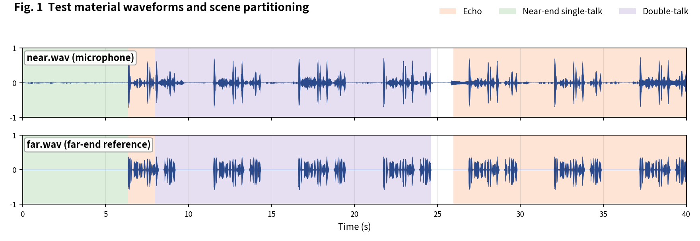
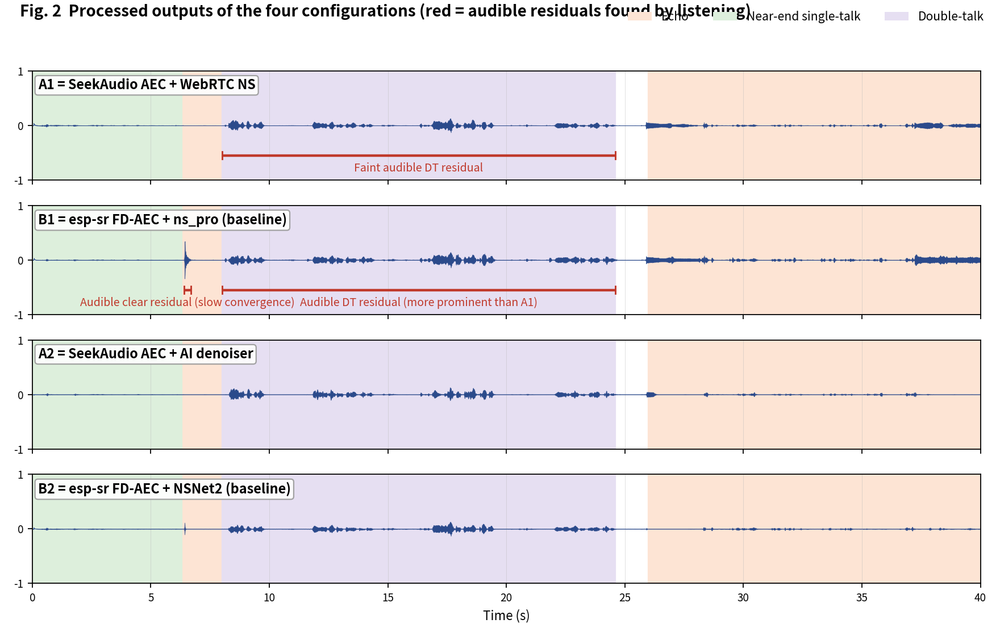
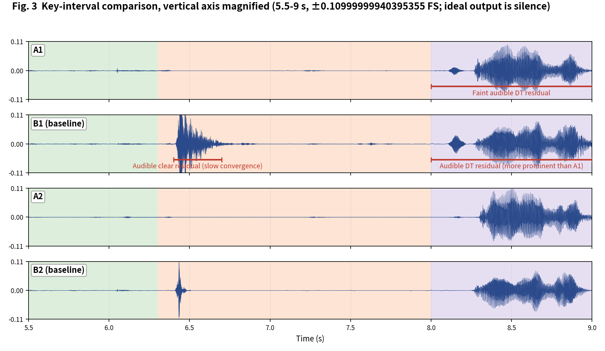

[简体中文](README.md) | English

# SeekAudio AEC Test Case 2

**Long double-talk clip: convergence speed and DT residual** · measured on ESP32-S3 · subjective + objective evaluation

## 1. Material and scenes

Recorded ~40 s long clip: near-end single-talk first, a long double-talk middle, echo at the end. Scene boundaries were annotated by listening:

- **Echo**: 6-8 s, 26-40 s
- **Near-end single-talk**: 0-6.3 s
- **Double-talk**: 8-24.6 s

The four configurations match the [main article](../../article/README_EN.md) (A1/B1 share the WebRTC NS tier, A2/B2 share the AI tier - a like-for-like pairing). All outputs were produced on an ESP32-S3 (240 MHz, 16 kHz, 32 ms frames).

**Raw output files of this case** (click to download / listen / view):

| File | Description |
|---|---|
| [near.wav](../../../output_dir/case2/near.wav) / [far.wav](../../../output_dir/case2/far.wav) | Test material (microphone / far-end reference) |
| [a1.wav](../../../output_dir/case2/a1.wav) [b1.wav](../../../output_dir/case2/b1.wav) [a2.wav](../../../output_dir/case2/a2.wav) [b2.wav](../../../output_dir/case2/b2.wav) | The four configurations' outputs on the ESP32-S3 |
| [log.txt](../../../output_dir/case2/log.txt) | Device serial log |
| [aec_report.txt](../../../output_dir/case2/aec_report.txt) / [aec_report_en.txt](../../../output_dir/case2/aec_report_en.txt) | Full automated report (CN / EN) |

## 2. Subjective evaluation: see it, hear it







**Listening verdict (headphones, segment-by-segment A/B; download the WAVs above and verify yourself):**

- **B1**: very clear residual echo at 6.4-6.7 s, plainly visible in the waveform - this sits at the start of an echo segment, showing B1 converges far more slowly than A1;
- **A1, A2**: no audible residual there; **B2**'s AI denoiser mostly removes it, though a trace remains;
- **Double-talk (8-24.6 s)**: residual echo is audible in both A1 and B1, but B1's is clearly more prominent.

## 3. Objective data

Metrics follow the main article (Microsoft AEC Challenge methodology + AECMOS + ERLE), computed by [aec_report_en.py](../../../tools/aec_report_en.py) automatically; bold marks the winner within each same-tier pair (A1 vs B1, A2 vs B2).

**On-device compute**

| Metric | A1 | A2 | B1 (baseline) | B2 (baseline) |
|---|---|---|---|---|
| CPU load, avg (%) | **27.6** | **37.8** | 60.1 | 72.8 |
| Real-time factor (higher is better) | **3.63×** | **2.64×** | 1.66× | 1.37× |

**Echo suppression and perceptual quality**

| Metric | A1 | A2 | B1 (baseline) | B2 (baseline) |
|---|---|---|---|---|
| FE-ST ERLE (dB, higher is better) | **15.5** | 24.0 | 12.3 | **25.7** |
| Residual echo (dBFS, lower is better) | **-38.4** | -46.9 | -35.2 | **-48.6** |
| NE-ST correlation | **0.932** | 0.633 | 0.853 | **0.902** |
| Path delay (ms) | **64** | 96 | 70 | **64** |
| AECMOS FE-ST Echo | **4.25** | 4.30 | 3.28 | **4.40** |
| AECMOS NE-ST Other | **2.46** | 1.91 | 2.36 | **2.90** |
| AECMOS DT Echo | **4.50** | **4.43** | 3.65 | 4.34 |
| AECMOS DT Other | **3.89** | 3.85 | 3.79 | **4.16** |
| AECMOS composite | **3.78** | 3.62 | 3.27 | **3.95** |

## 4. Analysis and verdict

The numbers match the ears exactly: B1 is the only config whose FE-ST Echo falls below 4 (3.28) with the lowest ERLE (12.3 dB); its more prominent DT residual maps to DT Echo 3.65 vs A1's 4.50. Note the near end is noisy in this clip (all four NE-ST Other scores are low), and A2's aggressive denoising pushes near-end naturalness down to 1.91.

**Verdict: A1 vs B1 - A1 wins every row** (all 17 quality rows in the paired comparison read win:A1). **A2 vs B2 - B2 on quality, A2 on compute**: B2 leads ERLE, near-end naturalness and the composite, which A2 trades for a 48% compute saving; for noisy near-end scenarios A1 or B2 are the safer tiers.

**Reproducing this case** (build/flash/run per the repo README, save the serial log as log.txt, unpack littlefs, add the AECMOS model to the same folder, then run):

```bash
python aec_report_en.py --echo 6:8,26:40 --near 0:6.3 --dt 8:24.6
```

---

*Test conditions: ESP32-S3 @ 240 MHz, 16 kHz, 32 ms/frame; baselines esp-sr v2.4.5, esp-dsp v1.8.0; figures generated by make_figs_v2.py; library baseline is commit `ca75b3d` - later library optimizations are not reflected in this report.*
