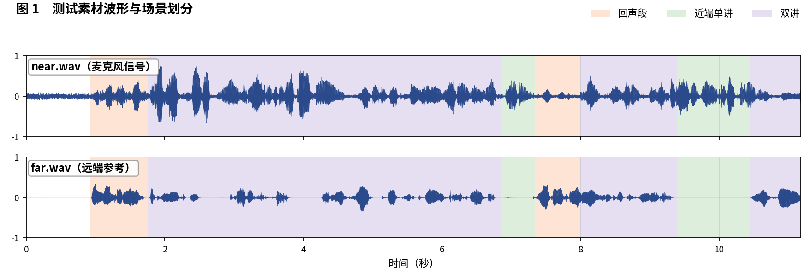
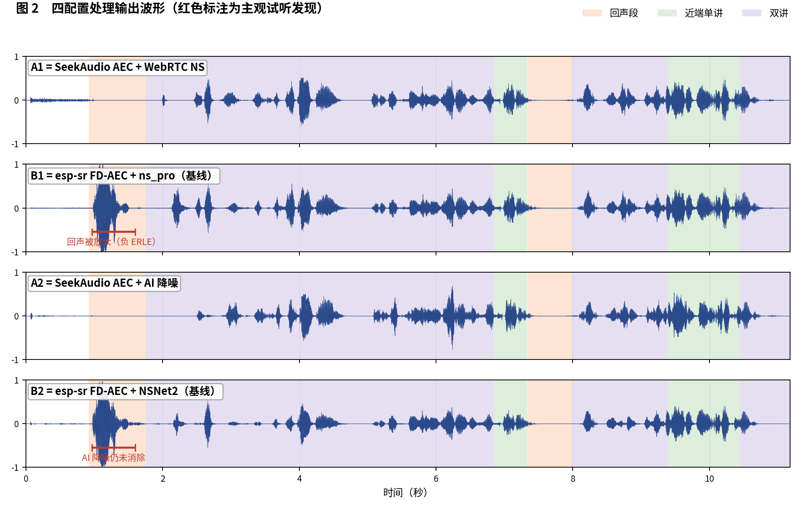
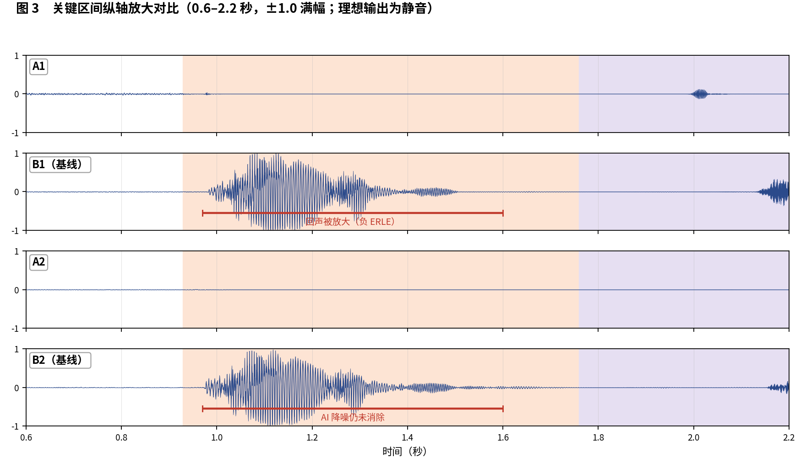

简体中文 | [English](README_EN.md)

# SeekAudio AEC 测试用例 3

**走动双讲样本：基线出现回声放大（负 ERLE）** · ESP32-S3 实测 · 主观 + 客观双重评估

## 一、素材与场景

素材取自微软 AEC Challenge 数据集：near/far 分别为 `fbkhafa8n0W-W8ytgzClpg_doubletalk_with_movement` 的 `_mic.wav` 与 `_lpb.wav`（带走动的双讲样本）。 人工试听标注场景边界如下：

- **回声段**：0.93–1.8 秒，7.35–8 秒
- **近端单讲**：6.85–7.33 秒，9.39–10.45 秒
- **双讲**：1.76–6.84 秒，8–9.38 秒，10.45–11.18 秒

四个被测配置与[主文章](../../article/README.md)一致（A1/B1 同为 WebRTC NS 降噪档、A2/B2 同为 AI 降噪档，两两对位公平）。四路输出均在 ESP32-S3（240 MHz，16 kHz，32 ms 帧）上实际运行产生。

**本用例原始输出文件**（点击即可下载试听 / 查看）：

| 文件 | 说明 |
|---|---|
| [near.wav](../../../output_dir/case3/near.wav) / [far.wav](../../../output_dir/case3/far.wav) | 测试素材（麦克风 / 远端参考） |
| [a1.wav](../../../output_dir/case3/a1.wav) [b1.wav](../../../output_dir/case3/b1.wav) [a2.wav](../../../output_dir/case3/a2.wav) [b2.wav](../../../output_dir/case3/b2.wav) | 四配置在 ESP32-S3 上的处理输出 |
| [log.txt](../../../output_dir/case3/log.txt) | 设备串口日志 |
| [aec_report.txt](../../../output_dir/case3/aec_report.txt) / [aec_report_en.txt](../../../output_dir/case3/aec_report_en.txt) | 完整自动化报告（中 / 英） |

## 二、主观评估：眼见为实，耳听为实







**试听结论（佩戴耳机逐段对听，欢迎下载上方 wav 亲自验证）：**

- 整体而言四个配置在本样本上的效果都不算理想；
- **B1**：不但没有消除回声，反而把回声**放大**了——看 0.97–1.6 秒段，波形比输入还大；这是非常严重的问题；
- **B2**：即使有 AI 降噪，也没能把这段被放大的回声消掉。

## 三、客观数据

指标体系与主文章一致（微软 AEC Challenge 方法 + AECMOS + ERLE），由 [aec_report.py](../../../tools/aec_report.py) 自动生成；加粗表示同档对比（A1 对 B1、A2 对 B2）中的占优方。

**设备端计算性能**

| 指标 | A1 | A2 | B1（基线） | B2（基线） |
|---|---|---|---|---|
| CPU 平均负载（%） | **28.9** | **38.2** | 61.4 | 74.3 |
| 实时率 RTF（越高越好） | **3.46×** | **2.62×** | 1.63× | 1.35× |

**回声抑制与感知质量**

| 指标 | A1 | A2 | B1（基线） | B2（基线） |
|---|---|---|---|---|
| FE-ST ERLE（dB，越高越好） | **27.9** | **25.7** | -10.0 | -9.8 |
| 残余回声（dBFS，越低越好） | **-51.9** | **-49.7** | -14.1 | -14.2 |
| NE-ST 近端相关度 | 0.975 | 0.928 | **0.989** | **0.964** |
| 链路延迟（ms） | **64** | 96 | 70 | **64** |
| AECMOS FE-ST Echo | **4.33** | 4.21 | 3.47 | **4.32** |
| AECMOS NE-ST Other | 3.58 | 3.37 | **3.85** | **3.89** |
| AECMOS DT Echo | **4.63** | 4.60 | 4.62 | **4.62** |
| AECMOS DT Other | 3.82 | 3.24 | **3.92** | **3.70** |
| AECMOS 综合 | **4.09** | 3.85 | 3.96 | **4.13** |

## 四、分析与判定

客观数据把这个发现钉死了：B1/B2 的 FE-ST ERLE 为 **−10.0 / −9.8 dB**——负号意味着输出的回声能量比麦克风输入还高，残余高达 −14 dBFS；A1/A2 为 +27.9 / +25.7 dB。走动导致回声路径时变，基线的线性滤波在此失稳。需要说明：本例 AECMOS 综合分四者接近（回声段很短，被整段平均稀释），但 FE-ST Echo 仍是 B1 最低（3.47），且'回声被放大'属于可闻的硬缺陷。

**判定：A 组胜**——在回声消除的物理量上（ERLE 正负之别）差距是数量级的；A2 对 B2 虽综合分小幅落后（3.85 对 4.13），但 B2 存在可闻的回声放大残余，抑制能力的差距（+25.7 对 −9.8 dB）不是感知分能弥补的。

**复现本用例**（按仓库主页 README 完成编译烧写运行，保存串口日志为 log.txt，解包 littlefs 后与 AECMOS 模型放入同一目录，执行）：

```bash
python aec_report.py --echo 0.93:1.8,7.35:8 --near 6.85:7.33,9.39:10.45,11.25:12.1 --dt 1.76:6.84,8:9.38,10.45:11.18
```

---

*测试条件：ESP32-S3 @ 240 MHz，16 kHz，32 ms/帧；对比基线 esp-sr v2.4.5、esp-dsp v1.8.0；波形图由 make_figs_v2.py 生成；评测库基线为提交 `ca75b3d`，此后的库优化不体现于本报告。*
