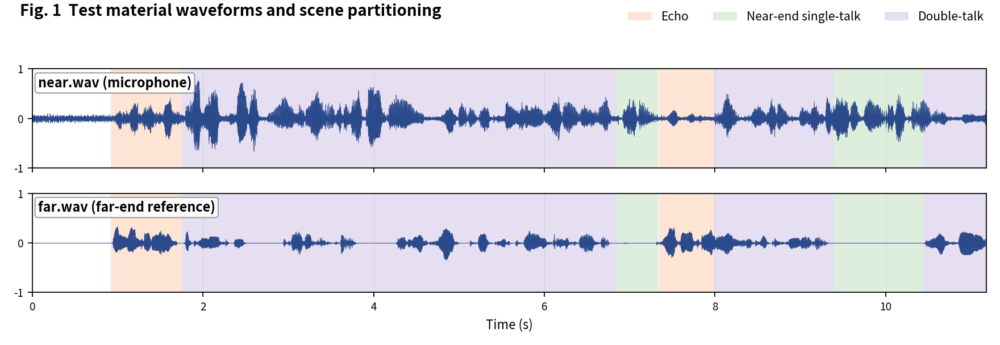
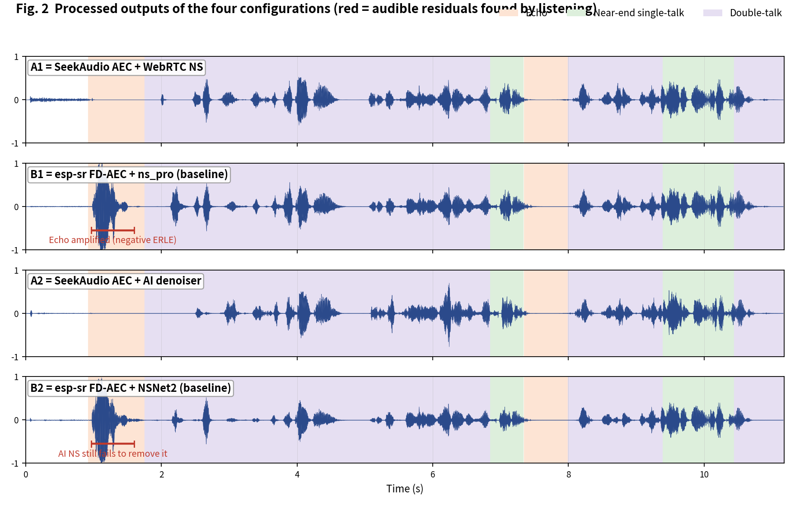
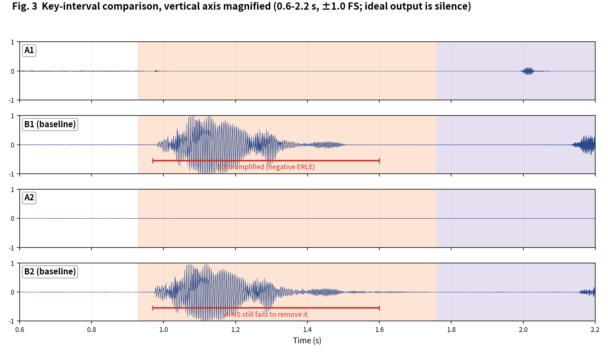

[简体中文](README.md) | English

# SeekAudio AEC Test Case 3

**Double-talk with movement: baseline amplifies the echo (negative ERLE)** · measured on ESP32-S3 · subjective + objective evaluation

## 1. Material and scenes

Material from the Microsoft AEC Challenge dataset: near/far are the `_mic.wav` and `_lpb.wav` of `fbkhafa8n0W-W8ytgzClpg_doubletalk_with_movement` (double-talk with movement). Scene boundaries were annotated by listening:

- **Echo**: 0.93-1.8 s, 7.35-8 s
- **Near-end single-talk**: 6.85-7.33 s, 9.39-10.45 s
- **Double-talk**: 1.76-6.84 s, 8-9.38 s, 10.45-11.18 s

The four configurations match the [main article](../../article/README_EN.md) (A1/B1 share the WebRTC NS tier, A2/B2 share the AI tier - a like-for-like pairing). All outputs were produced on an ESP32-S3 (240 MHz, 16 kHz, 32 ms frames).

**Raw output files of this case** (click to download / listen / view):

| File | Description |
|---|---|
| [near.wav](../../../output_dir/case3/near.wav) / [far.wav](../../../output_dir/case3/far.wav) | Test material (microphone / far-end reference) |
| [a1.wav](../../../output_dir/case3/a1.wav) [b1.wav](../../../output_dir/case3/b1.wav) [a2.wav](../../../output_dir/case3/a2.wav) [b2.wav](../../../output_dir/case3/b2.wav) | The four configurations' outputs on the ESP32-S3 |
| [log.txt](../../../output_dir/case3/log.txt) | Device serial log |
| [aec_report.txt](../../../output_dir/case3/aec_report.txt) / [aec_report_en.txt](../../../output_dir/case3/aec_report_en.txt) | Full automated report (CN / EN) |

## 2. Subjective evaluation: see it, hear it







**Listening verdict (headphones, segment-by-segment A/B; download the WAVs above and verify yourself):**

- Overall none of the four configs is ideal on this clip;
- **B1**: far from cancelling the echo, it **amplifies** it - see 0.97-1.6 s, where the output waveform exceeds the input; a severe defect;
- **B2**: even with AI denoising, this amplified echo is not removed.

## 3. Objective data

Metrics follow the main article (Microsoft AEC Challenge methodology + AECMOS + ERLE), computed by [aec_report_en.py](../../../tools/aec_report_en.py) automatically; bold marks the winner within each same-tier pair (A1 vs B1, A2 vs B2).

**On-device compute**

| Metric | A1 | A2 | B1 (baseline) | B2 (baseline) |
|---|---|---|---|---|
| CPU load, avg (%) | **28.9** | **38.2** | 61.4 | 74.3 |
| Real-time factor (higher is better) | **3.46×** | **2.62×** | 1.63× | 1.35× |

**Echo suppression and perceptual quality**

| Metric | A1 | A2 | B1 (baseline) | B2 (baseline) |
|---|---|---|---|---|
| FE-ST ERLE (dB, higher is better) | **27.9** | **25.7** | -10.0 | -9.8 |
| Residual echo (dBFS, lower is better) | **-51.9** | **-49.7** | -14.1 | -14.2 |
| NE-ST correlation | 0.975 | 0.928 | **0.989** | **0.964** |
| Path delay (ms) | **64** | 96 | 70 | **64** |
| AECMOS FE-ST Echo | **4.33** | 4.21 | 3.47 | **4.32** |
| AECMOS NE-ST Other | 3.58 | 3.37 | **3.85** | **3.89** |
| AECMOS DT Echo | **4.63** | 4.60 | 4.62 | **4.62** |
| AECMOS DT Other | 3.82 | 3.24 | **3.92** | **3.70** |
| AECMOS composite | **4.09** | 3.85 | 3.96 | **4.13** |

## 4. Analysis and verdict

The objective data nails the finding: B1/B2's FE-ST ERLE is **-10.0 / -9.8 dB** - the negative sign means the output carries more echo energy than the microphone input, with residuals up to -14 dBFS; A1/A2 measure +27.9 / +25.7 dB. Movement makes the echo path time-varying, and the baseline's linear filter destabilizes. Note that AECMOS composites are close across the four (the echo segments are short and diluted by whole-segment averaging), yet FE-ST Echo is still lowest for B1 (3.47), and audible echo amplification is a hard defect.

**Verdict: group A wins** - on the physical quantity of echo cancellation (positive vs negative ERLE) the gap is an order of magnitude. A2 trails B2 slightly on the composite (3.85 vs 4.13), but B2 carries an audible amplified residual; a suppression gap of +25.7 vs -9.8 dB is not something a perception score can compensate.

**Reproducing this case** (build/flash/run per the repo README, save the serial log as log.txt, unpack littlefs, add the AECMOS model to the same folder, then run):

```bash
python aec_report_en.py --echo 0.93:1.8,7.35:8 --near 6.85:7.33,9.39:10.45,11.25:12.1 --dt 1.76:6.84,8:9.38,10.45:11.18
```

---

*Test conditions: ESP32-S3 @ 240 MHz, 16 kHz, 32 ms/frame; baselines esp-sr v2.4.5, esp-dsp v1.8.0; figures generated by make_figs_v2.py; library baseline is commit `ca75b3d` - later library optimizations are not reflected in this report.*
