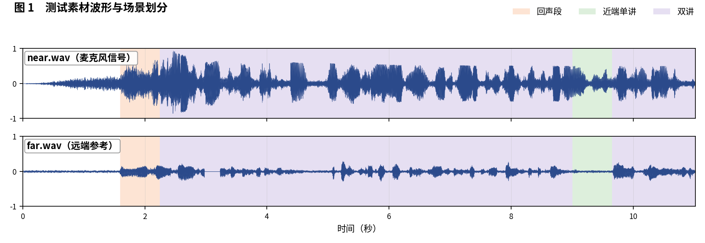
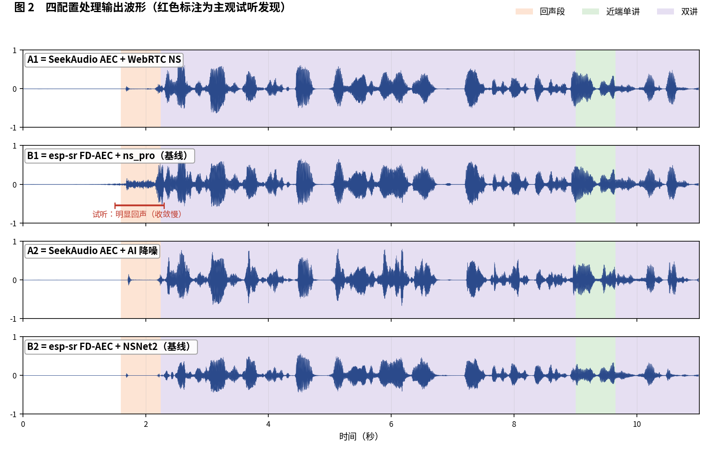
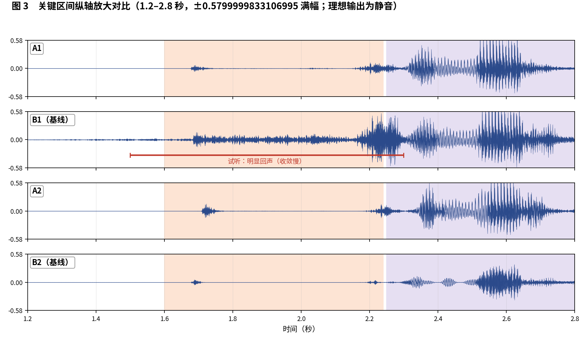

简体中文 | [English](README_EN.md)

# SeekAudio AEC 测试用例 4

**双讲样本：开头段收敛速度对比** · ESP32-S3 实测 · 主观 + 客观双重评估

## 一、素材与场景

素材取自微软 AEC Challenge 数据集：near/far 分别为 `DNb0qIMRg0iwJqiYFx6RbA_doubletalk` 的 `_mic.wav` 与 `_lpb.wav`。 人工试听标注场景边界如下：

- **回声段**：1.6–2.24 秒
- **近端单讲**：9–9.65 秒
- **双讲**：2.25–9 秒，9.66–11.02 秒

四个被测配置与[主文章](../../article/README.md)一致（A1/B1 同为 WebRTC NS 降噪档、A2/B2 同为 AI 降噪档，两两对位公平）。四路输出均在 ESP32-S3（240 MHz，16 kHz，32 ms 帧）上实际运行产生。

**本用例原始输出文件**（点击即可下载试听 / 查看）：

| 文件 | 说明 |
|---|---|
| [near.wav](../../../output_dir/case4/near.wav) / [far.wav](../../../output_dir/case4/far.wav) | 测试素材（麦克风 / 远端参考） |
| [a1.wav](../../../output_dir/case4/a1.wav) [b1.wav](../../../output_dir/case4/b1.wav) [a2.wav](../../../output_dir/case4/a2.wav) [b2.wav](../../../output_dir/case4/b2.wav) | 四配置在 ESP32-S3 上的处理输出 |
| [log.txt](../../../output_dir/case4/log.txt) | 设备串口日志 |
| [aec_report.txt](../../../output_dir/case4/aec_report.txt) / [aec_report_en.txt](../../../output_dir/case4/aec_report_en.txt) | 完整自动化报告（中 / 英） |

## 二、主观评估：眼见为实，耳听为实







**试听结论（佩戴耳机逐段对听，欢迎下载上方 wav 亲自验证）：**

- **B1**：1.5–2.3 秒（样本开头的回声段）回声非常明显——**A1 没有这个问题，说明 B1 收敛速度太慢**；
- **B2**：借 AI 降噪成功把这段回声消掉了；
- 其余部分四个配置听感区别不大。

## 三、客观数据

指标体系与主文章一致（微软 AEC Challenge 方法 + AECMOS + ERLE），由 [aec_report.py](../../../tools/aec_report.py) 自动生成；加粗表示同档对比（A1 对 B1、A2 对 B2）中的占优方。

**设备端计算性能**

| 指标 | A1 | A2 | B1（基线） | B2（基线） |
|---|---|---|---|---|
| CPU 平均负载（%） | **29.3** | **38.8** | 61.6 | 74.2 |
| 实时率 RTF（越高越好） | **3.41×** | **2.58×** | 1.62× | 1.35× |

**回声抑制与感知质量**

| 指标 | A1 | A2 | B1（基线） | B2（基线） |
|---|---|---|---|---|
| FE-ST ERLE（dB，越高越好） | **23.0** | 23.2 | 9.6 | **30.8** |
| 残余回声（dBFS，越低越好） | **-38.8** | -39.0 | -25.4 | **-46.6** |
| NE-ST 近端相关度 | **0.938** | **0.913** | 0.928 | 0.860 |
| 链路延迟（ms） | **64** | 96 | 70 | **64** |
| AECMOS FE-ST Echo | **4.17** | **4.08** | 2.74 | 3.61 |
| AECMOS NE-ST Other | 3.40 | 3.46 | **3.64** | **3.79** |
| AECMOS DT Echo | **4.60** | **4.48** | 4.21 | 4.22 |
| AECMOS DT Other | 4.22 | **4.10** | **4.28** | 3.97 |
| AECMOS 综合 | **4.10** | **4.03** | 3.72 | 3.90 |

## 四、分析与判定

听到的开头漏回声在数据里读数明确：B1 的 FE-ST Echo 仅 2.74（四者最低）、ERLE 9.6 dB 对 A1 的 23.0 dB。A2 对 B2 一如既往是风格取舍：B2 抑制更深（ERLE 30.8 对 23.2），A2 综合分与双讲回声分更高（4.03/4.48 对 3.90/4.22）且省 48% 算力。

**判定：A1 对 B1 —— A1 胜**（收敛速度的差距在开头段直接可闻）。**A2 对 B2 —— 各有胜场**，主观区别不大，按算力预算取舍即可。

**复现本用例**（按仓库主页 README 完成编译烧写运行，保存串口日志为 log.txt，解包 littlefs 后与 AECMOS 模型放入同一目录，执行）：

```bash
python aec_report.py --echo 1.6:2.24 --near 9:9.65 --dt 2.25:9,9.66:11.02
```

---

*测试条件：ESP32-S3 @ 240 MHz，16 kHz，32 ms/帧；对比基线 esp-sr v2.4.5、esp-dsp v1.8.0；波形图由 make_figs_v2.py 生成；评测库基线为提交 `ca75b3d`，此后的库优化不体现于本报告。*
