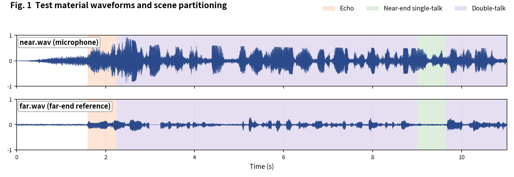
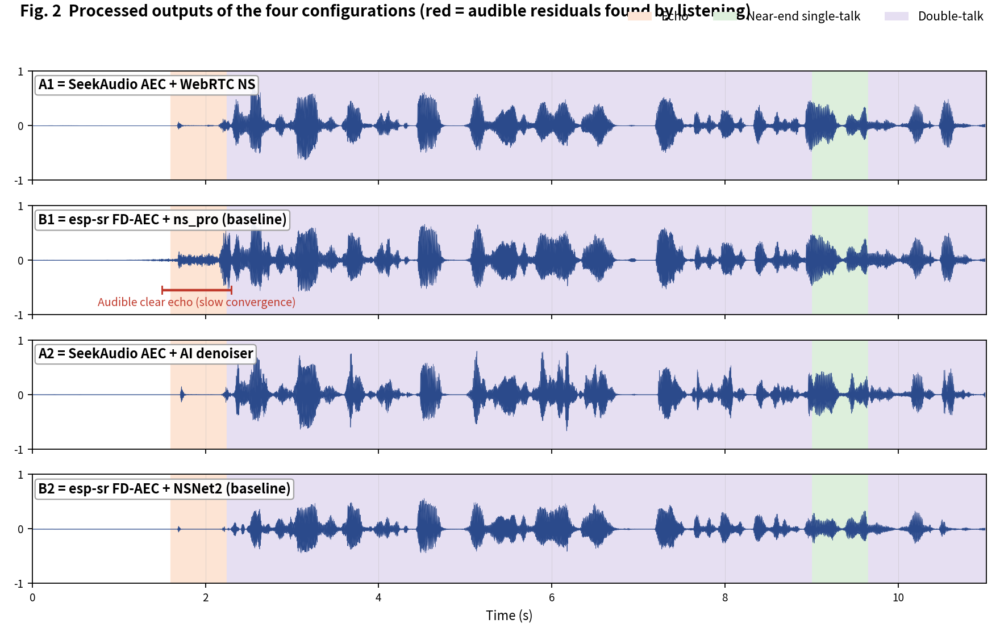
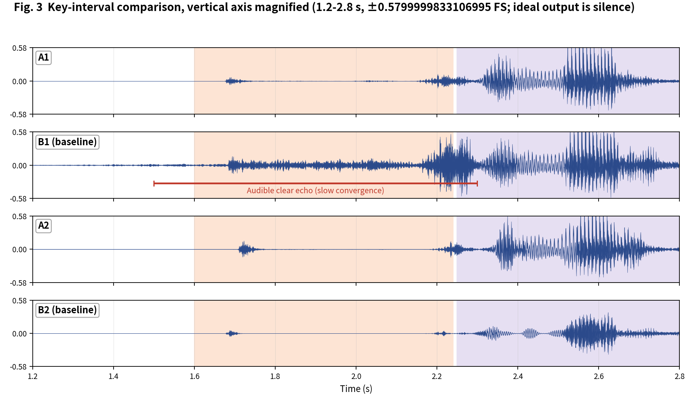

[简体中文](README.md) | English

# SeekAudio AEC Test Case 4

**Double-talk clip: opening-segment convergence** · measured on ESP32-S3 · subjective + objective evaluation

## 1. Material and scenes

Material from the Microsoft AEC Challenge dataset: near/far are the `_mic.wav` and `_lpb.wav` of `DNb0qIMRg0iwJqiYFx6RbA_doubletalk`. Scene boundaries were annotated by listening:

- **Echo**: 1.6-2.24 s
- **Near-end single-talk**: 9-9.65 s
- **Double-talk**: 2.25-9 s, 9.66-11.02 s

The four configurations match the [main article](../../article/README_EN.md) (A1/B1 share the WebRTC NS tier, A2/B2 share the AI tier - a like-for-like pairing). All outputs were produced on an ESP32-S3 (240 MHz, 16 kHz, 32 ms frames).

**Raw output files of this case** (click to download / listen / view):

| File | Description |
|---|---|
| [near.wav](../../../output_dir/case4/near.wav) / [far.wav](../../../output_dir/case4/far.wav) | Test material (microphone / far-end reference) |
| [a1.wav](../../../output_dir/case4/a1.wav) [b1.wav](../../../output_dir/case4/b1.wav) [a2.wav](../../../output_dir/case4/a2.wav) [b2.wav](../../../output_dir/case4/b2.wav) | The four configurations' outputs on the ESP32-S3 |
| [log.txt](../../../output_dir/case4/log.txt) | Device serial log |
| [aec_report.txt](../../../output_dir/case4/aec_report.txt) / [aec_report_en.txt](../../../output_dir/case4/aec_report_en.txt) | Full automated report (CN / EN) |

## 2. Subjective evaluation: see it, hear it







**Listening verdict (headphones, segment-by-segment A/B; download the WAVs above and verify yourself):**

- **B1**: very obvious echo at 1.5-2.3 s (the opening echo segment) - **A1 has no such problem, showing B1 converges too slowly**;
- **B2**: its AI denoiser successfully removes that echo;
- elsewhere the four configs sound about the same.

## 3. Objective data

Metrics follow the main article (Microsoft AEC Challenge methodology + AECMOS + ERLE), computed by [aec_report_en.py](../../../tools/aec_report_en.py) automatically; bold marks the winner within each same-tier pair (A1 vs B1, A2 vs B2).

**On-device compute**

| Metric | A1 | A2 | B1 (baseline) | B2 (baseline) |
|---|---|---|---|---|
| CPU load, avg (%) | **29.3** | **38.8** | 61.6 | 74.2 |
| Real-time factor (higher is better) | **3.41×** | **2.58×** | 1.62× | 1.35× |

**Echo suppression and perceptual quality**

| Metric | A1 | A2 | B1 (baseline) | B2 (baseline) |
|---|---|---|---|---|
| FE-ST ERLE (dB, higher is better) | **23.0** | 23.2 | 9.6 | **30.8** |
| Residual echo (dBFS, lower is better) | **-38.8** | -39.0 | -25.4 | **-46.6** |
| NE-ST correlation | **0.938** | **0.913** | 0.928 | 0.860 |
| Path delay (ms) | **64** | 96 | 70 | **64** |
| AECMOS FE-ST Echo | **4.17** | **4.08** | 2.74 | 3.61 |
| AECMOS NE-ST Other | 3.40 | 3.46 | **3.64** | **3.79** |
| AECMOS DT Echo | **4.60** | **4.48** | 4.21 | 4.22 |
| AECMOS DT Other | 4.22 | **4.10** | **4.28** | 3.97 |
| AECMOS composite | **4.10** | **4.03** | 3.72 | 3.90 |

## 4. Analysis and verdict

The audible opening leak reads clearly in the data: B1's FE-ST Echo is only 2.74 (lowest of the four) with 9.6 dB ERLE vs A1's 23.0 dB. A2 vs B2 is the usual style trade-off: B2 suppresses deeper (ERLE 30.8 vs 23.2), while A2 scores higher on the composite and DT Echo (4.03/4.48 vs 3.90/4.22) and saves 48% compute.

**Verdict: A1 vs B1 - A1 wins** (the convergence gap is directly audible in the opening segment). **A2 vs B2 - split**, subjectively similar; choose by compute budget.

**Reproducing this case** (build/flash/run per the repo README, save the serial log as log.txt, unpack littlefs, add the AECMOS model to the same folder, then run):

```bash
python aec_report_en.py --echo 1.6:2.24 --near 9:9.65 --dt 2.25:9,9.66:11.02
```

---

*Test conditions: ESP32-S3 @ 240 MHz, 16 kHz, 32 ms/frame; baselines esp-sr v2.4.5, esp-dsp v1.8.0; figures generated by make_figs_v2.py; library baseline is commit `ca75b3d` - later library optimizations are not reflected in this report.*
