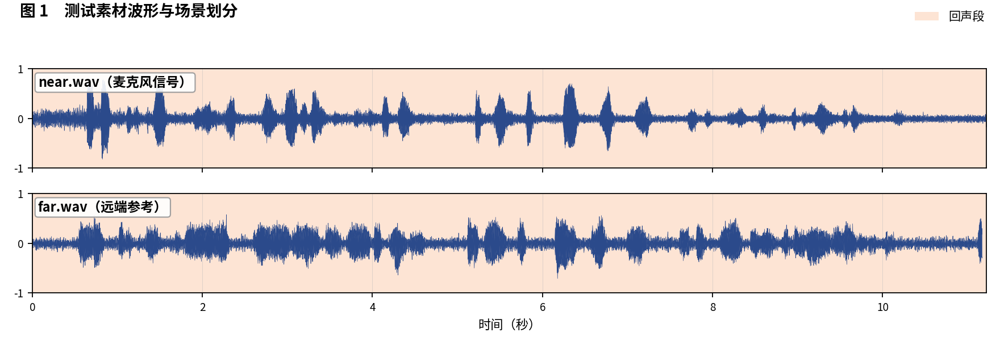
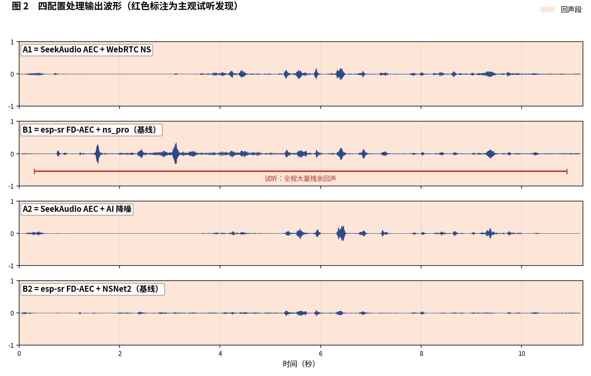
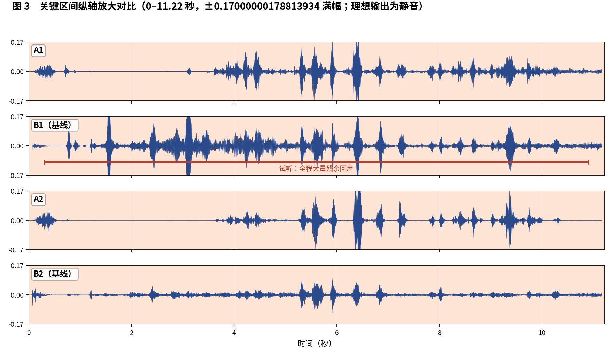

简体中文 | [English](README_EN.md)

# SeekAudio AEC 测试用例 5

**纯回声难样本：残余量级对比** · ESP32-S3 实测 · 主观 + 客观双重评估

## 一、素材与场景

素材取自微软 AEC Challenge 数据集：near/far 分别为 `FGqMw1OM4Um5uvmHahuZbg_farend_singletalk` 的 `_mic.wav` 与 `_lpb.wav`。样本只有回声，没有近端与双讲。 人工试听标注场景边界如下：

- **回声段**：0–11.22 秒

四个被测配置与[主文章](../../article/README.md)一致（A1/B1 同为 WebRTC NS 降噪档、A2/B2 同为 AI 降噪档，两两对位公平）。四路输出均在 ESP32-S3（240 MHz，16 kHz，32 ms 帧）上实际运行产生。

**本用例原始输出文件**（点击即可下载试听 / 查看）：

| 文件 | 说明 |
|---|---|
| [near.wav](../../../output_dir/case5/near.wav) / [far.wav](../../../output_dir/case5/far.wav) | 测试素材（麦克风 / 远端参考） |
| [a1.wav](../../../output_dir/case5/a1.wav) [b1.wav](../../../output_dir/case5/b1.wav) [a2.wav](../../../output_dir/case5/a2.wav) [b2.wav](../../../output_dir/case5/b2.wav) | 四配置在 ESP32-S3 上的处理输出 |
| [log.txt](../../../output_dir/case5/log.txt) | 设备串口日志 |
| [aec_report.txt](../../../output_dir/case5/aec_report.txt) / [aec_report_en.txt](../../../output_dir/case5/aec_report_en.txt) | 完整自动化报告（中 / 英） |

## 二、主观评估：眼见为实，耳听为实







**试听结论（佩戴耳机逐段对听，欢迎下载上方 wav 亲自验证）：**

- 单从波形就能看出差异很大：**B1 几乎全程都是回声**；
- **A1** 也有不少残余，但远少于 B1；
- **A2、B2** 的 AI 降噪能进一步压低残余，试听感受 **B2 消得更干净**。

## 三、客观数据

指标体系与主文章一致（微软 AEC Challenge 方法 + AECMOS + ERLE），由 [aec_report.py](../../../tools/aec_report.py) 自动生成；加粗表示同档对比（A1 对 B1、A2 对 B2）中的占优方。

**设备端计算性能**

| 指标 | A1 | A2 | B1（基线） | B2（基线） |
|---|---|---|---|---|
| CPU 平均负载（%） | **28.4** | **37.3** | 61.6 | 74.4 |
| 实时率 RTF（越高越好） | **3.52×** | **2.68×** | 1.62× | 1.34× |

**回声抑制与感知质量**

| 指标 | A1 | A2 | B1（基线） | B2（基线） |
|---|---|---|---|---|
| FE-ST ERLE（dB，越高越好） | **16.0** | 16.2 | 11.6 | **21.6** |
| 残余回声（dBFS，越低越好） | **-37.1** | -37.3 | -32.7 | **-42.7** |
| 链路延迟（ms） | **64** | 96 | 70 | **64** |
| AECMOS FE-ST Echo | **2.59** | **3.30** | 2.26 | 2.72 |
| AECMOS 综合 | **2.59** | **3.30** | 2.26 | 2.72 |

## 四、分析与判定

这是一个全员偏难的样本（AECMOS 分数整体偏低）。ERLE 与听感一致：A1 16.0 dB 对 B1 11.6 dB，B2 以 21.6 dB 居首——与'B2 消得更干净'的耳感吻合。一个值得注意的分歧：AECMOS FE-ST Echo 却把 A2 排第一（3.30 对 B2 的 2.72）——在低分段，评分模型对不同残余'风格'的排序可能与人耳不完全一致，这正是我们同时提供主观与客观两条证据链的原因。

**判定：A1 对 B1 —— A1 胜**（ERLE、感知分、听感三者一致）。**A2 对 B2 —— 平手偏各取所需**：B2 抑制深度最佳，A2 感知分最高且只用一半算力。

**复现本用例**（按仓库主页 README 完成编译烧写运行，保存串口日志为 log.txt，解包 littlefs 后与 AECMOS 模型放入同一目录，执行）：

```bash
python aec_report.py --echo 0:11.22 --no-auto
```

---

*测试条件：ESP32-S3 @ 240 MHz，16 kHz，32 ms/帧；对比基线 esp-sr v2.4.5、esp-dsp v1.8.0；波形图由 make_figs_v2.py 生成；评测库基线为提交 `ca75b3d`，此后的库优化不体现于本报告。*
