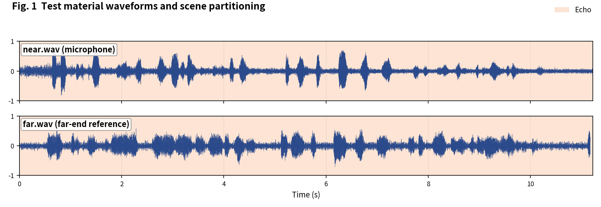
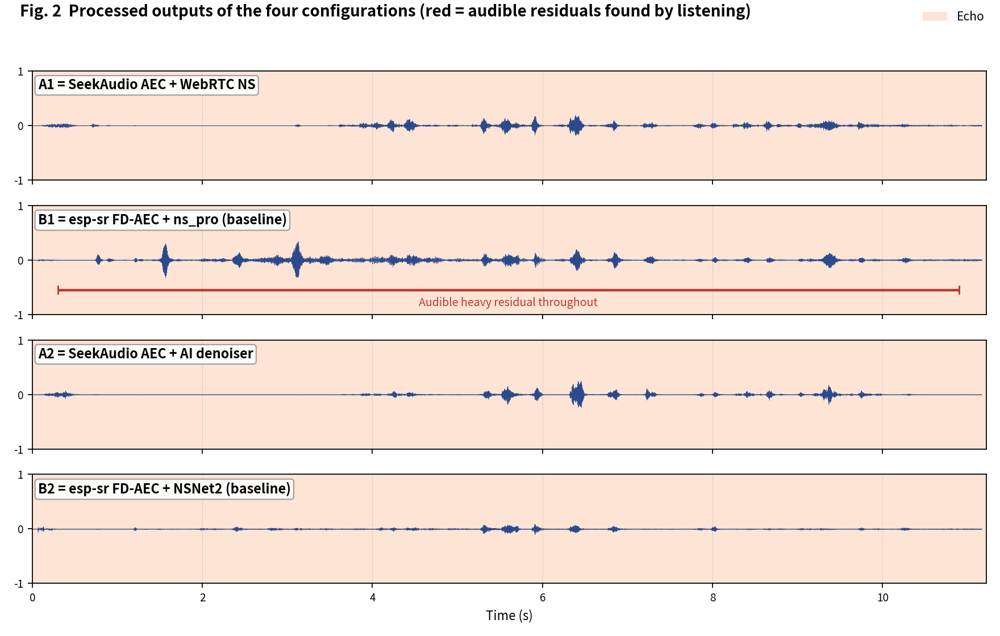
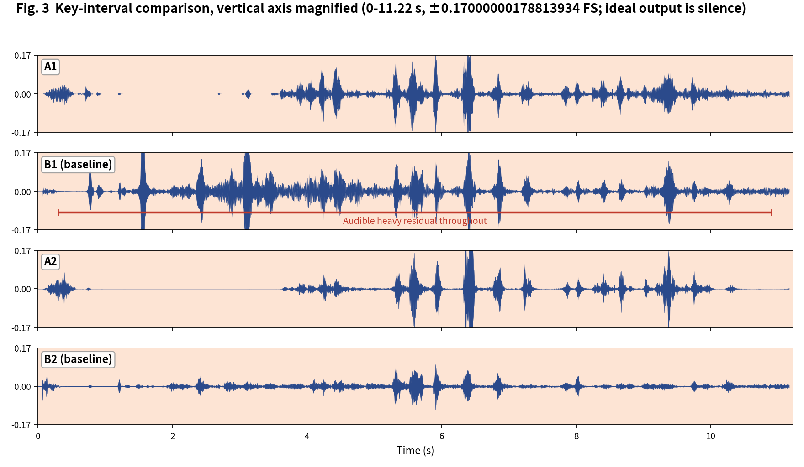

[简体中文](README.md) | English

# SeekAudio AEC Test Case 5

**Echo-only hard clip: residual magnitude comparison** · measured on ESP32-S3 · subjective + objective evaluation

## 1. Material and scenes

Material from the Microsoft AEC Challenge dataset: near/far are the `_mic.wav` and `_lpb.wav` of `FGqMw1OM4Um5uvmHahuZbg_farend_singletalk`. Echo only - no near-end or double-talk. Scene boundaries were annotated by listening:

- **Echo**: 0-11.22 s

The four configurations match the [main article](../../article/README_EN.md) (A1/B1 share the WebRTC NS tier, A2/B2 share the AI tier - a like-for-like pairing). All outputs were produced on an ESP32-S3 (240 MHz, 16 kHz, 32 ms frames).

**Raw output files of this case** (click to download / listen / view):

| File | Description |
|---|---|
| [near.wav](../../../output_dir/case5/near.wav) / [far.wav](../../../output_dir/case5/far.wav) | Test material (microphone / far-end reference) |
| [a1.wav](../../../output_dir/case5/a1.wav) [b1.wav](../../../output_dir/case5/b1.wav) [a2.wav](../../../output_dir/case5/a2.wav) [b2.wav](../../../output_dir/case5/b2.wav) | The four configurations' outputs on the ESP32-S3 |
| [log.txt](../../../output_dir/case5/log.txt) | Device serial log |
| [aec_report.txt](../../../output_dir/case5/aec_report.txt) / [aec_report_en.txt](../../../output_dir/case5/aec_report_en.txt) | Full automated report (CN / EN) |

## 2. Subjective evaluation: see it, hear it







**Listening verdict (headphones, segment-by-segment A/B; download the WAVs above and verify yourself):**

- The waveforms alone show a large gap: **B1 is nearly all residual echo**;
- **A1** also leaves noticeable residual, but far less than B1;
- **A2 and B2**'s AI denoisers push the residual further down; by ear **B2 removes it more cleanly**.

## 3. Objective data

Metrics follow the main article (Microsoft AEC Challenge methodology + AECMOS + ERLE), computed by [aec_report_en.py](../../../tools/aec_report_en.py) automatically; bold marks the winner within each same-tier pair (A1 vs B1, A2 vs B2).

**On-device compute**

| Metric | A1 | A2 | B1 (baseline) | B2 (baseline) |
|---|---|---|---|---|
| CPU load, avg (%) | **28.4** | **37.3** | 61.6 | 74.4 |
| Real-time factor (higher is better) | **3.52×** | **2.68×** | 1.62× | 1.34× |

**Echo suppression and perceptual quality**

| Metric | A1 | A2 | B1 (baseline) | B2 (baseline) |
|---|---|---|---|---|
| FE-ST ERLE (dB, higher is better) | **16.0** | 16.2 | 11.6 | **21.6** |
| Residual echo (dBFS, lower is better) | **-37.1** | -37.3 | -32.7 | **-42.7** |
| Path delay (ms) | **64** | 96 | 70 | **64** |
| AECMOS FE-ST Echo | **2.59** | **3.30** | 2.26 | 2.72 |
| AECMOS composite | **2.59** | **3.30** | 2.26 | 2.72 |

## 4. Analysis and verdict

A hard clip for everyone (AECMOS scores are low across the board). ERLE matches the ears: A1 16.0 dB vs B1 11.6 dB, with B2 leading at 21.6 dB - consistent with hearing B2 as the cleanest. One notable divergence: AECMOS FE-ST Echo ranks A2 first (3.30 vs B2's 2.72) - in the low-score regime the model's ranking of different residual 'styles' may not fully match human ears, which is exactly why we present both subjective and objective evidence.

**Verdict: A1 vs B1 - A1 wins** (ERLE, perception score and listening all agree). **A2 vs B2 - a draw, pick your priority**: B2 has the deepest suppression; A2 has the highest perception score at half the compute.

**Reproducing this case** (build/flash/run per the repo README, save the serial log as log.txt, unpack littlefs, add the AECMOS model to the same folder, then run):

```bash
python aec_report_en.py --echo 0:11.22 --no-auto
```

---

*Test conditions: ESP32-S3 @ 240 MHz, 16 kHz, 32 ms/frame; baselines esp-sr v2.4.5, esp-dsp v1.8.0; figures generated by make_figs_v2.py; library baseline is commit `ca75b3d` - later library optimizations are not reflected in this report.*
