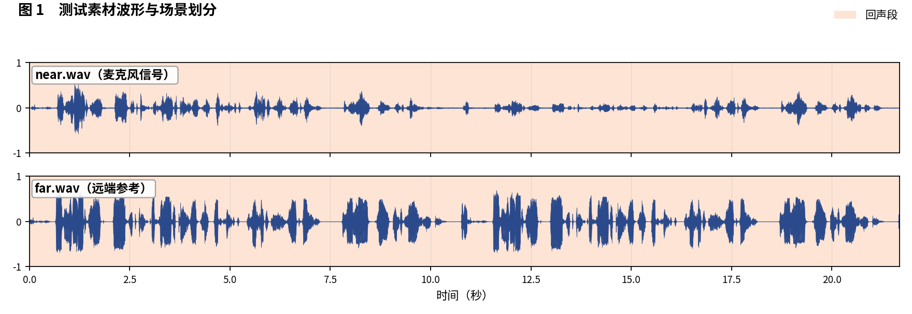
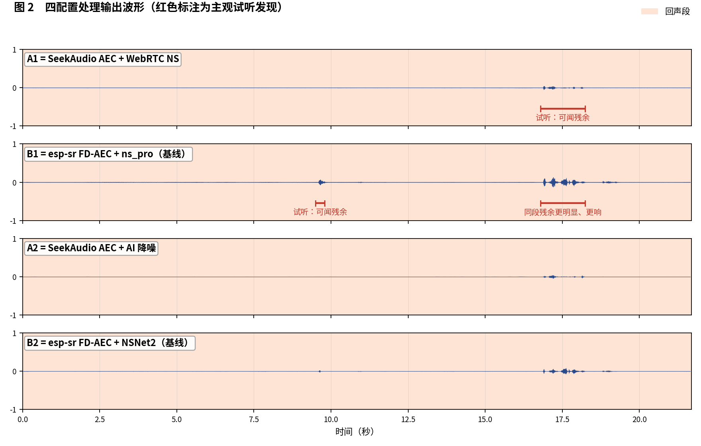
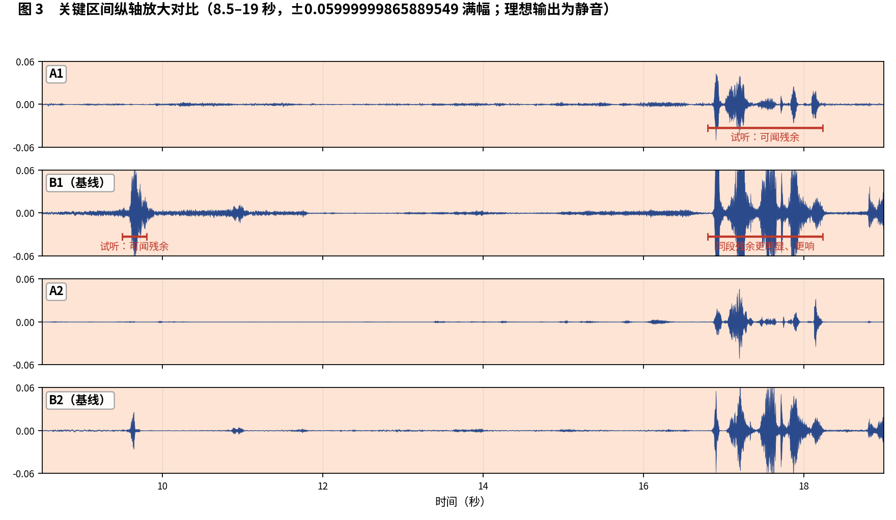

简体中文 | [English](README_EN.md)

# SeekAudio AEC 测试用例 6

**纯回声长样本：残余位置逐点对比** · ESP32-S3 实测 · 主观 + 客观双重评估

## 一、素材与场景

素材取自微软 AEC Challenge 数据集：near/far 分别为 `0J0xIs0HJUK2Ex8rHAH2pA_farend_singletalk` 的 `_mic.wav` 与 `_lpb.wav`。样本全部为回声段。 人工试听标注场景边界如下：

- **回声段**：0–21.68 秒

四个被测配置与[主文章](../../article/README.md)一致（A1/B1 同为 WebRTC NS 降噪档、A2/B2 同为 AI 降噪档，两两对位公平）。四路输出均在 ESP32-S3（240 MHz，16 kHz，32 ms 帧）上实际运行产生。

**本用例原始输出文件**（点击即可下载试听 / 查看）：

| 文件 | 说明 |
|---|---|
| [near.wav](../../../output_dir/case6/near.wav) / [far.wav](../../../output_dir/case6/far.wav) | 测试素材（麦克风 / 远端参考） |
| [a1.wav](../../../output_dir/case6/a1.wav) [b1.wav](../../../output_dir/case6/b1.wav) [a2.wav](../../../output_dir/case6/a2.wav) [b2.wav](../../../output_dir/case6/b2.wav) | 四配置在 ESP32-S3 上的处理输出 |
| [log.txt](../../../output_dir/case6/log.txt) | 设备串口日志 |
| [aec_report.txt](../../../output_dir/case6/aec_report.txt) / [aec_report_en.txt](../../../output_dir/case6/aec_report_en.txt) | 完整自动化报告（中 / 英） |

## 二、主观评估：眼见为实，耳听为实







**试听结论（佩戴耳机逐段对听，欢迎下载上方 wav 亲自验证）：**

- **A1**：16.8–18.24 秒可闻残余回声；
- **B1**：同一段残余**更明显、更响**，且 9.5–9.8 秒还多一处可闻残余；
- **A2 对 B2**：得益于更好的 AEC 前级，16.8–18.24 秒这段 A2 的表现也优于 B2。

## 三、客观数据

指标体系与主文章一致（微软 AEC Challenge 方法 + AECMOS + ERLE），由 [aec_report.py](../../../tools/aec_report.py) 自动生成；加粗表示同档对比（A1 对 B1、A2 对 B2）中的占优方。

**设备端计算性能**

| 指标 | A1 | A2 | B1（基线） | B2（基线） |
|---|---|---|---|---|
| CPU 平均负载（%） | **28.9** | **38.3** | 61.6 | 74.3 |
| 实时率 RTF（越高越好） | **3.46×** | **2.61×** | 1.62× | 1.35× |

**回声抑制与感知质量**

| 指标 | A1 | A2 | B1（基线） | B2（基线） |
|---|---|---|---|---|
| FE-ST ERLE（dB，越高越好） | **28.5** | **31.1** | 18.2 | 23.7 |
| 残余回声（dBFS，越低越好） | **-56.7** | **-59.3** | -46.4 | -51.8 |
| 链路延迟（ms） | **64** | 96 | 70 | **64** |
| AECMOS FE-ST Echo | **4.01** | **4.03** | 2.82 | 2.99 |
| AECMOS 综合 | **4.01** | **4.03** | 2.82 | 2.99 |

## 四、分析与判定

感知分给出了本组测试中最大的分差之一：A1/A2 为 4.01/4.03，B1/B2 仅 2.82/2.99——超过 1 分的差距在 MOS 体系里是'可用'与'勉强'的档位之差。ERLE 同向：A 组在长回声样本上的稳态抑制显著更强。

**判定：A 组双双大幅领先**，同档对比 A1 胜 B1、A2 胜 B2，且都伴随约一半的算力节省。

**复现本用例**（按仓库主页 README 完成编译烧写运行，保存串口日志为 log.txt，解包 littlefs 后与 AECMOS 模型放入同一目录，执行）：

```bash
python aec_report.py --echo 0:21.68 --no-auto
```

---

*测试条件：ESP32-S3 @ 240 MHz，16 kHz，32 ms/帧；对比基线 esp-sr v2.4.5、esp-dsp v1.8.0；波形图由 make_figs_v2.py 生成；评测库基线为提交 `ca75b3d`，此后的库优化不体现于本报告。*
