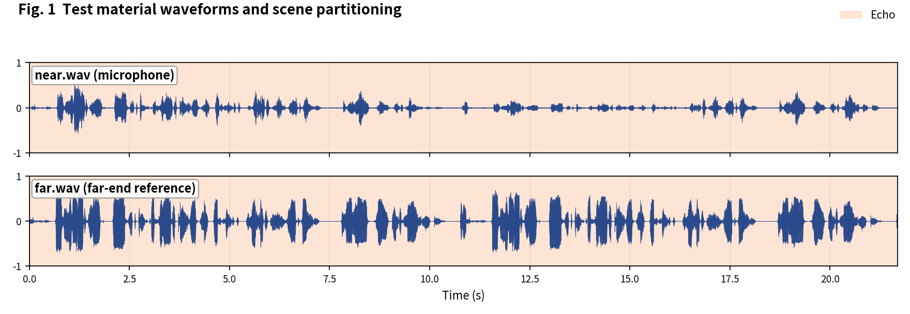
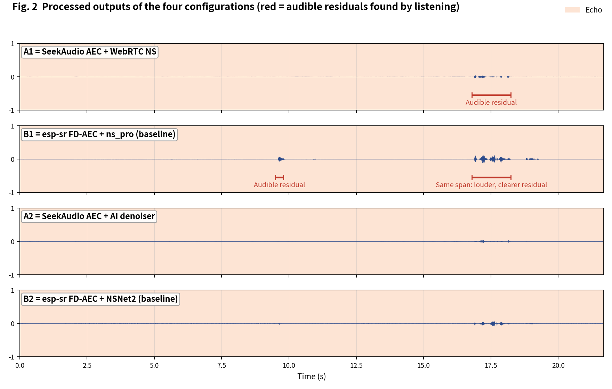
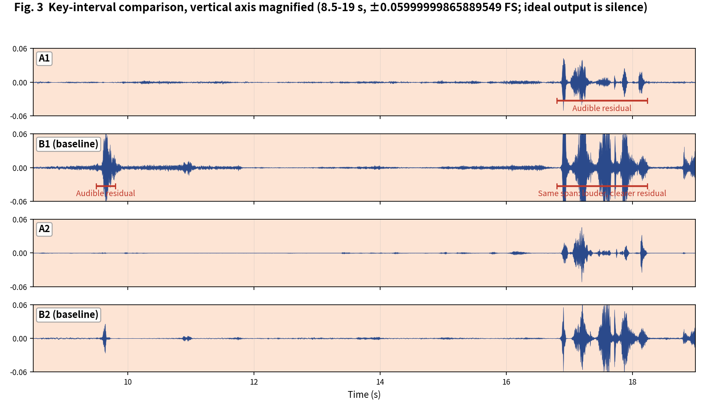

[简体中文](README.md) | English

# SeekAudio AEC Test Case 6

**Long echo-only clip: point-by-point residual comparison** · measured on ESP32-S3 · subjective + objective evaluation

## 1. Material and scenes

Material from the Microsoft AEC Challenge dataset: near/far are the `_mic.wav` and `_lpb.wav` of `0J0xIs0HJUK2Ex8rHAH2pA_farend_singletalk`. The entire clip is echo. Scene boundaries were annotated by listening:

- **Echo**: 0-21.68 s

The four configurations match the [main article](../../article/README_EN.md) (A1/B1 share the WebRTC NS tier, A2/B2 share the AI tier - a like-for-like pairing). All outputs were produced on an ESP32-S3 (240 MHz, 16 kHz, 32 ms frames).

**Raw output files of this case** (click to download / listen / view):

| File | Description |
|---|---|
| [near.wav](../../../output_dir/case6/near.wav) / [far.wav](../../../output_dir/case6/far.wav) | Test material (microphone / far-end reference) |
| [a1.wav](../../../output_dir/case6/a1.wav) [b1.wav](../../../output_dir/case6/b1.wav) [a2.wav](../../../output_dir/case6/a2.wav) [b2.wav](../../../output_dir/case6/b2.wav) | The four configurations' outputs on the ESP32-S3 |
| [log.txt](../../../output_dir/case6/log.txt) | Device serial log |
| [aec_report.txt](../../../output_dir/case6/aec_report.txt) / [aec_report_en.txt](../../../output_dir/case6/aec_report_en.txt) | Full automated report (CN / EN) |

## 2. Subjective evaluation: see it, hear it







**Listening verdict (headphones, segment-by-segment A/B; download the WAVs above and verify yourself):**

- **A1**: audible residual at 16.8-18.24 s;
- **B1**: in the same span the residual is **clearer and louder**, with an extra audible residual at 9.5-9.8 s;
- **A2 vs B2**: thanks to the better AEC stage, A2 also outperforms B2 in the 16.8-18.24 s span.

## 3. Objective data

Metrics follow the main article (Microsoft AEC Challenge methodology + AECMOS + ERLE), computed by [aec_report_en.py](../../../tools/aec_report_en.py) automatically; bold marks the winner within each same-tier pair (A1 vs B1, A2 vs B2).

**On-device compute**

| Metric | A1 | A2 | B1 (baseline) | B2 (baseline) |
|---|---|---|---|---|
| CPU load, avg (%) | **28.9** | **38.3** | 61.6 | 74.3 |
| Real-time factor (higher is better) | **3.46×** | **2.61×** | 1.62× | 1.35× |

**Echo suppression and perceptual quality**

| Metric | A1 | A2 | B1 (baseline) | B2 (baseline) |
|---|---|---|---|---|
| FE-ST ERLE (dB, higher is better) | **28.5** | **31.1** | 18.2 | 23.7 |
| Residual echo (dBFS, lower is better) | **-56.7** | **-59.3** | -46.4 | -51.8 |
| Path delay (ms) | **64** | 96 | 70 | **64** |
| AECMOS FE-ST Echo | **4.01** | **4.03** | 2.82 | 2.99 |
| AECMOS composite | **4.01** | **4.03** | 2.82 | 2.99 |

## 4. Analysis and verdict

The perception scores show one of the largest gaps in this whole suite: A1/A2 at 4.01/4.03 vs B1/B2 at only 2.82/2.99 - a gap of more than one MOS point separates 'usable' from 'barely'. ERLE points the same way: group A's steady-state suppression on a long echo clip is much stronger.

**Verdict: group A leads by a wide margin in both tiers** - A1 beats B1 and A2 beats B2, each at roughly half the compute.

**Reproducing this case** (build/flash/run per the repo README, save the serial log as log.txt, unpack littlefs, add the AECMOS model to the same folder, then run):

```bash
python aec_report_en.py --echo 0:21.68 --no-auto
```

---

*Test conditions: ESP32-S3 @ 240 MHz, 16 kHz, 32 ms/frame; baselines esp-sr v2.4.5, esp-dsp v1.8.0; figures generated by make_figs_v2.py; library baseline is commit `ca75b3d` - later library optimizations are not reflected in this report.*
