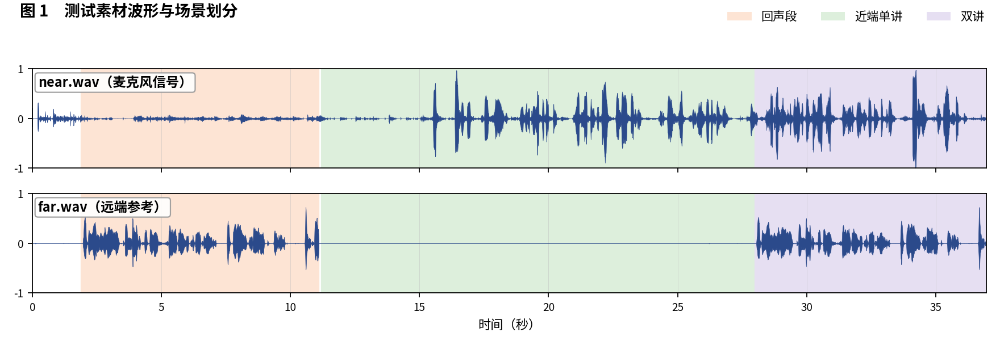
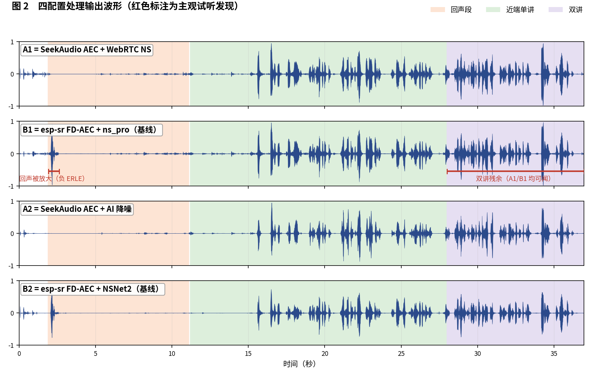
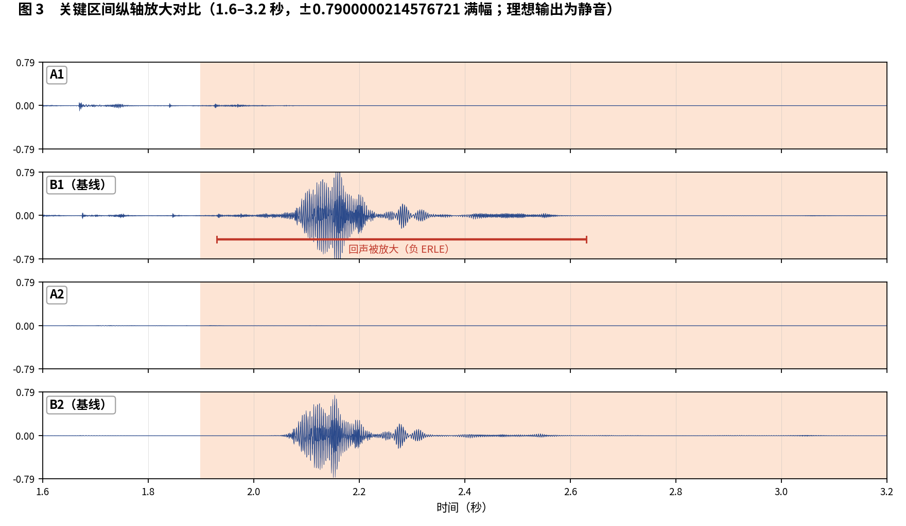

简体中文 | [English](README_EN.md)

# SeekAudio AEC 测试用例 7

**走动+极低回声电平：又一例基线回声放大** · ESP32-S3 实测 · 主观 + 客观双重评估

## 一、素材与场景

素材取自微软 AEC Challenge 数据集：near/far 分别为 `0RUf4sZjqUe862S4gVpZlA_doubletalk_with_movement` 的 `_mic.wav` 与 `_lpb.wav`（带走动的双讲样本，回声电平极低：−39.8 dBFS）。 人工试听标注场景边界如下：

- **回声段**：1.9–11.1 秒
- **近端单讲**：11.2–28 秒
- **双讲**：28–36.95 秒

四个被测配置与[主文章](../../article/README.md)一致（A1/B1 同为 WebRTC NS 降噪档、A2/B2 同为 AI 降噪档，两两对位公平）。四路输出均在 ESP32-S3（240 MHz，16 kHz，32 ms 帧）上实际运行产生。

**本用例原始输出文件**（点击即可下载试听 / 查看）：

| 文件 | 说明 |
|---|---|
| [near.wav](../../../output_dir/case7/near.wav) / [far.wav](../../../output_dir/case7/far.wav) | 测试素材（麦克风 / 远端参考） |
| [a1.wav](../../../output_dir/case7/a1.wav) [b1.wav](../../../output_dir/case7/b1.wav) [a2.wav](../../../output_dir/case7/a2.wav) [b2.wav](../../../output_dir/case7/b2.wav) | 四配置在 ESP32-S3 上的处理输出 |
| [log.txt](../../../output_dir/case7/log.txt) | 设备串口日志 |
| [aec_report.txt](../../../output_dir/case7/aec_report.txt) / [aec_report_en.txt](../../../output_dir/case7/aec_report_en.txt) | 完整自动化报告（中 / 英） |

## 二、主观评估：眼见为实，耳听为实







**试听结论（佩戴耳机逐段对听，欢迎下载上方 wav 亲自验证）：**

- **B1**：再次出现严重问题——1.93–2.63 秒回声被**进一步放大**；**B2** 的 AI 降噪也没能把这段消掉；
- **A1**：2.65–11.1 秒的回声消除比 B1 更彻底；
- **双讲段（28–36.95 秒）**：A1 和 B1 都有很多残余回声——这是对全部配置都困难的一段。

## 三、客观数据

指标体系与主文章一致（微软 AEC Challenge 方法 + AECMOS + ERLE），由 [aec_report.py](../../../tools/aec_report.py) 自动生成；加粗表示同档对比（A1 对 B1、A2 对 B2）中的占优方。

**设备端计算性能**

| 指标 | A1 | A2 | B1（基线） | B2（基线） |
|---|---|---|---|---|
| CPU 平均负载（%） | **26.6** | **36.3** | 58.5 | 71.1 |
| 实时率 RTF（越高越好） | **3.77×** | **2.75×** | 1.71× | 1.41× |

**回声抑制与感知质量**

| 指标 | A1 | A2 | B1（基线） | B2（基线） |
|---|---|---|---|---|
| FE-ST ERLE（dB，越高越好） | **8.7** | **13.0** | -10.9 | -9.1 |
| 残余回声（dBFS，越低越好） | **-48.5** | **-52.8** | -28.9 | -30.7 |
| NE-ST 近端相关度 | **0.999** | 0.900 | 0.998 | **0.956** |
| 链路延迟（ms） | **64** | 96 | 70 | **64** |
| AECMOS FE-ST Echo | 3.40 | 3.65 | **4.15** | **4.11** |
| AECMOS NE-ST Other | 3.29 | 2.27 | **3.88** | **3.79** |
| AECMOS DT Echo | 1.84 | 2.80 | **1.94** | **3.22** |
| AECMOS DT Other | 3.87 | 3.32 | **4.00** | **4.16** |
| AECMOS 综合 | 3.10 | 3.01 | **3.49** | **3.82** |

## 四、分析与判定

与 case3 同样的机制在此复现：B1/B2 的 FE-ST ERLE 为 **−10.9 / −9.1 dB**（回声被放大），A1/A2 为 +8.7 / +13.0 dB。本例如实呈现两点对 A 组不利的数据：双讲段四者的 DT Echo 都很低（1.84–3.22），B2 借 AI 降噪兜底相对最好（3.22）；综合分也是 B2 最高（3.82）。原因是本例回声电平极低（−39.8 dBFS）且带走动，属于对抑制'风格'极度敏感的边缘样本。

**判定：分裂**——回声消除的物理量上 A 组明确胜出（正 ERLE 对负 ERLE，'放大回声'是硬缺陷）；感知综合分上 B2 领先。这是十个用例中对 A 组最不利的一例，我们照登。

**复现本用例**（按仓库主页 README 完成编译烧写运行，保存串口日志为 log.txt，解包 littlefs 后与 AECMOS 模型放入同一目录，执行）：

```bash
python aec_report.py --echo 1.9:11.1 --near 11.2:28 --dt 28:36.95
```

---

*测试条件：ESP32-S3 @ 240 MHz，16 kHz，32 ms/帧；对比基线 esp-sr v2.4.5、esp-dsp v1.8.0；波形图由 make_figs_v2.py 生成；评测库基线为提交 `ca75b3d`，此后的库优化不体现于本报告。*
