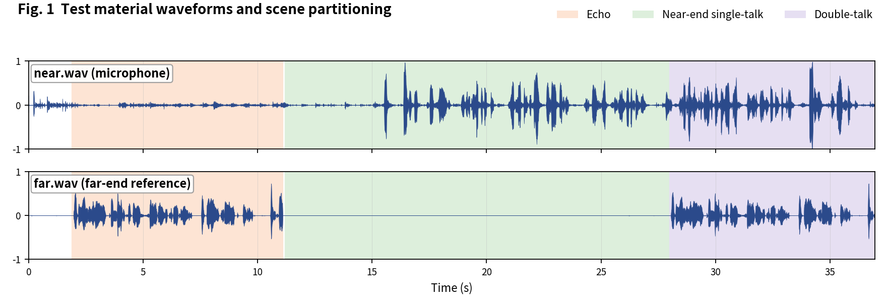
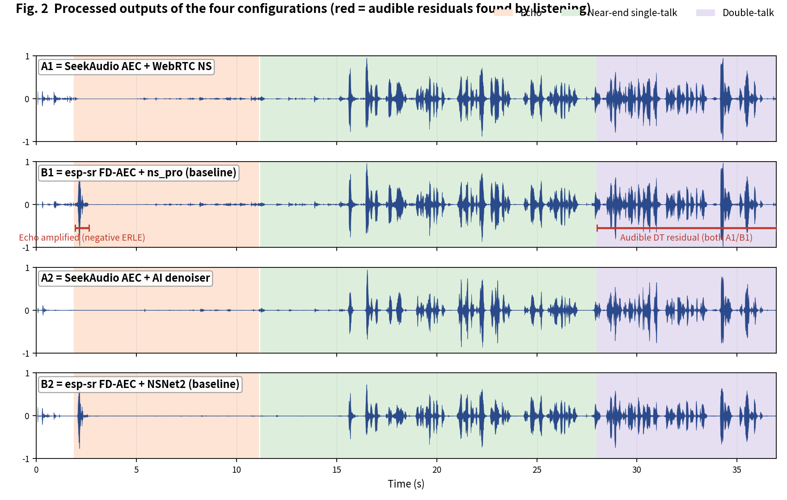
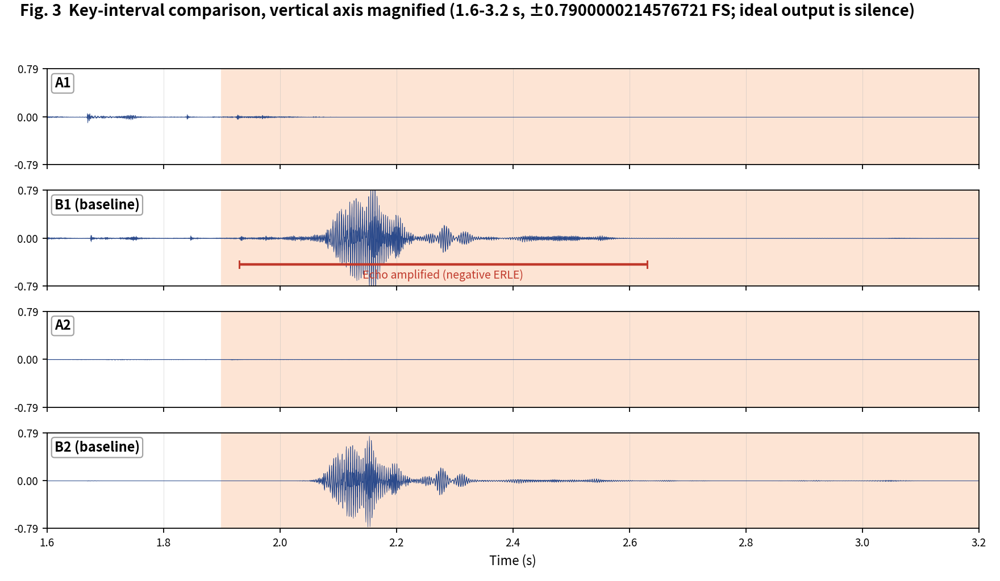

[简体中文](README.md) | English

# SeekAudio AEC Test Case 7

**Movement + very low echo level: another baseline echo-amplification case** · measured on ESP32-S3 · subjective + objective evaluation

## 1. Material and scenes

Material from the Microsoft AEC Challenge dataset: near/far are the `_mic.wav` and `_lpb.wav` of `0RUf4sZjqUe862S4gVpZlA_doubletalk_with_movement` (double-talk with movement; very low echo level: -39.8 dBFS). Scene boundaries were annotated by listening:

- **Echo**: 1.9-11.1 s
- **Near-end single-talk**: 11.2-28 s
- **Double-talk**: 28-36.95 s

The four configurations match the [main article](../../article/README_EN.md) (A1/B1 share the WebRTC NS tier, A2/B2 share the AI tier - a like-for-like pairing). All outputs were produced on an ESP32-S3 (240 MHz, 16 kHz, 32 ms frames).

**Raw output files of this case** (click to download / listen / view):

| File | Description |
|---|---|
| [near.wav](../../../output_dir/case7/near.wav) / [far.wav](../../../output_dir/case7/far.wav) | Test material (microphone / far-end reference) |
| [a1.wav](../../../output_dir/case7/a1.wav) [b1.wav](../../../output_dir/case7/b1.wav) [a2.wav](../../../output_dir/case7/a2.wav) [b2.wav](../../../output_dir/case7/b2.wav) | The four configurations' outputs on the ESP32-S3 |
| [log.txt](../../../output_dir/case7/log.txt) | Device serial log |
| [aec_report.txt](../../../output_dir/case7/aec_report.txt) / [aec_report_en.txt](../../../output_dir/case7/aec_report_en.txt) | Full automated report (CN / EN) |

## 2. Subjective evaluation: see it, hear it







**Listening verdict (headphones, segment-by-segment A/B; download the WAVs above and verify yourself):**

- **B1**: the severe problem recurs - the echo at 1.93-2.63 s is **amplified**; **B2**'s AI denoiser also fails to remove it;
- **A1**: over 2.65-11.1 s its echo removal is more thorough than B1's;
- **Double-talk (28-36.95 s)**: both A1 and B1 leave plenty of residual - a hard span for every config.

## 3. Objective data

Metrics follow the main article (Microsoft AEC Challenge methodology + AECMOS + ERLE), computed by [aec_report_en.py](../../../tools/aec_report_en.py) automatically; bold marks the winner within each same-tier pair (A1 vs B1, A2 vs B2).

**On-device compute**

| Metric | A1 | A2 | B1 (baseline) | B2 (baseline) |
|---|---|---|---|---|
| CPU load, avg (%) | **26.6** | **36.3** | 58.5 | 71.1 |
| Real-time factor (higher is better) | **3.77×** | **2.75×** | 1.71× | 1.41× |

**Echo suppression and perceptual quality**

| Metric | A1 | A2 | B1 (baseline) | B2 (baseline) |
|---|---|---|---|---|
| FE-ST ERLE (dB, higher is better) | **8.7** | **13.0** | -10.9 | -9.1 |
| Residual echo (dBFS, lower is better) | **-48.5** | **-52.8** | -28.9 | -30.7 |
| NE-ST correlation | **0.999** | 0.900 | 0.998 | **0.956** |
| Path delay (ms) | **64** | 96 | 70 | **64** |
| AECMOS FE-ST Echo | 3.40 | 3.65 | **4.15** | **4.11** |
| AECMOS NE-ST Other | 3.29 | 2.27 | **3.88** | **3.79** |
| AECMOS DT Echo | 1.84 | 2.80 | **1.94** | **3.22** |
| AECMOS DT Other | 3.87 | 3.32 | **4.00** | **4.16** |
| AECMOS composite | 3.10 | 3.01 | **3.49** | **3.82** |

## 4. Analysis and verdict

The same mechanism as case 3 recurs: B1/B2's FE-ST ERLE is **-10.9 / -9.1 dB** (echo amplified) vs A1/A2's +8.7 / +13.0 dB. We also report two data points unfavorable to group A: all four configs score low on DT Echo (1.84-3.22), with B2's AI denoiser providing the best backstop (3.22); B2 also has the highest composite (3.82). The clip's very low echo level (-39.8 dBFS) plus movement makes it an edge case highly sensitive to suppression 'style'.

**Verdict: split** - on the physics of echo cancellation group A clearly wins (positive vs negative ERLE; amplifying echo is a hard defect); on the perceptual composite B2 leads. This is the least favorable of the ten cases for group A, and we publish it as is.

**Reproducing this case** (build/flash/run per the repo README, save the serial log as log.txt, unpack littlefs, add the AECMOS model to the same folder, then run):

```bash
python aec_report_en.py --echo 1.9:11.1 --near 11.2:28 --dt 28:36.95
```

---

*Test conditions: ESP32-S3 @ 240 MHz, 16 kHz, 32 ms/frame; baselines esp-sr v2.4.5, esp-dsp v1.8.0; figures generated by make_figs_v2.py; library baseline is commit `ca75b3d` - later library optimizations are not reflected in this report.*
