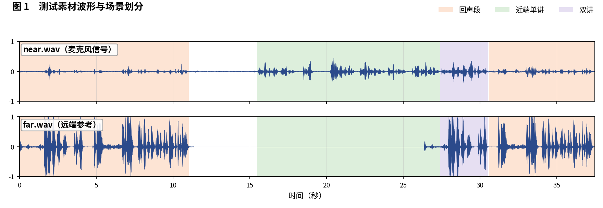
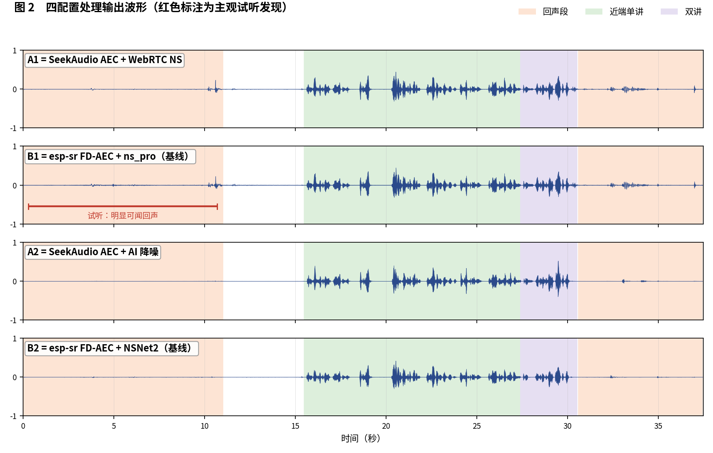
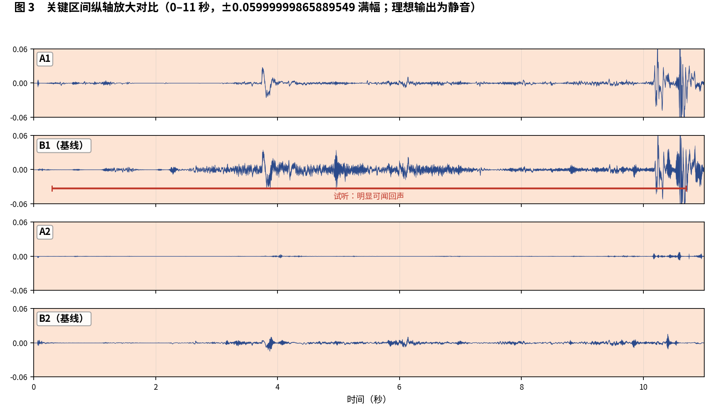

简体中文 | [English](README_EN.md)

# SeekAudio AEC 测试用例 8

**双回声段样本：开头段可闻差异** · ESP32-S3 实测 · 主观 + 客观双重评估

## 一、素材与场景

素材取自微软 AEC Challenge 数据集：near/far 分别为 `mAVjs9dULk24wBwJUyuzcw_doubletalk_with_movement` 的 `_mic.wav` 与 `_lpb.wav`。 人工试听标注场景边界如下：

- **回声段**：0–11 秒，30.6–37.4 秒
- **近端单讲**：15.5–27.4 秒
- **双讲**：27.4–30.5 秒

四个被测配置与[主文章](../../article/README.md)一致（A1/B1 同为 WebRTC NS 降噪档、A2/B2 同为 AI 降噪档，两两对位公平）。四路输出均在 ESP32-S3（240 MHz，16 kHz，32 ms 帧）上实际运行产生。

**本用例原始输出文件**（点击即可下载试听 / 查看）：

| 文件 | 说明 |
|---|---|
| [near.wav](../../../output_dir/case8/near.wav) / [far.wav](../../../output_dir/case8/far.wav) | 测试素材（麦克风 / 远端参考） |
| [a1.wav](../../../output_dir/case8/a1.wav) [b1.wav](../../../output_dir/case8/b1.wav) [a2.wav](../../../output_dir/case8/a2.wav) [b2.wav](../../../output_dir/case8/b2.wav) | 四配置在 ESP32-S3 上的处理输出 |
| [log.txt](../../../output_dir/case8/log.txt) | 设备串口日志 |
| [aec_report.txt](../../../output_dir/case8/aec_report.txt) / [aec_report_en.txt](../../../output_dir/case8/aec_report_en.txt) | 完整自动化报告（中 / 英） |

## 二、主观评估：眼见为实，耳听为实







**试听结论（佩戴耳机逐段对听，欢迎下载上方 wav 亲自验证）：**

- **B1**：0–11 秒回声段有明显可闻回声，波形差距也很直观；**A1** 在同一段无明显残余；
- 其他区段听感差别不大；**B2 与 A2** 也区别不大。

## 三、客观数据

指标体系与主文章一致（微软 AEC Challenge 方法 + AECMOS + ERLE），由 [aec_report.py](../../../tools/aec_report.py) 自动生成；加粗表示同档对比（A1 对 B1、A2 对 B2）中的占优方。

**设备端计算性能**

| 指标 | A1 | A2 | B1（基线） | B2（基线） |
|---|---|---|---|---|
| CPU 平均负载（%） | **26.6** | **36.7** | 58.5 | 71.2 |
| 实时率 RTF（越高越好） | **3.76×** | **2.72×** | 1.71× | 1.40× |

**回声抑制与感知质量**

| 指标 | A1 | A2 | B1（基线） | B2（基线） |
|---|---|---|---|---|
| FE-ST ERLE（dB，越高越好） | **5.1** | **21.0** | 4.8 | 18.0 |
| 残余回声（dBFS，越低越好） | **-39.9** | **-55.8** | -39.6 | -52.9 |
| NE-ST 近端相关度 | **0.992** | 0.874 | 0.991 | **0.986** |
| 链路延迟（ms） | **64** | 96 | 70 | **64** |
| AECMOS FE-ST Echo | **4.38** | 3.98 | 3.99 | **4.25** |
| AECMOS NE-ST Other | 4.17 | 4.25 | **4.35** | **4.40** |
| AECMOS DT Echo | 4.66 | 4.62 | **4.70** | **4.72** |
| AECMOS DT Other | **4.37** | 3.94 | 4.27 | **4.42** |
| AECMOS 综合 | **4.40** | 4.20 | 4.33 | **4.45** |

## 四、分析与判定

可闻差异落在 FE-ST Echo 上：A1 4.38 对 B1 3.99。本例回声电平较低（−34.9 dBFS），ERLE 绝对值都小（A1 5.1 对 B1 4.8）。如实说明：本例整体差距不大，综合分甚至是 B2 最高（4.45），B1 也有 4.33——十个用例并非每例都是大分差，这正是全量公开的意义。

**判定：A1 对 B1 —— A1 小胜**（唯一可闻差异 + FE 感知分领先）；**A2 对 B2 —— 基本平手**，B2 综合分略高，A2 省 48% 算力。

**复现本用例**（按仓库主页 README 完成编译烧写运行，保存串口日志为 log.txt，解包 littlefs 后与 AECMOS 模型放入同一目录，执行）：

```bash
python aec_report.py --echo 0:11,30.6:37.4 --near 15.5:27.4 --dt 27.4:30.5
```

---

*测试条件：ESP32-S3 @ 240 MHz，16 kHz，32 ms/帧；对比基线 esp-sr v2.4.5、esp-dsp v1.8.0；波形图由 make_figs_v2.py 生成；评测库基线为提交 `ca75b3d`，此后的库优化不体现于本报告。*
