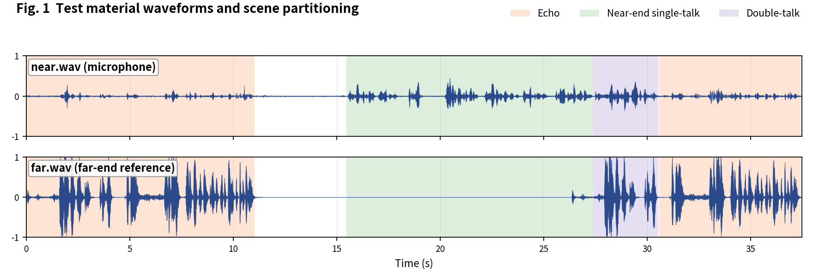
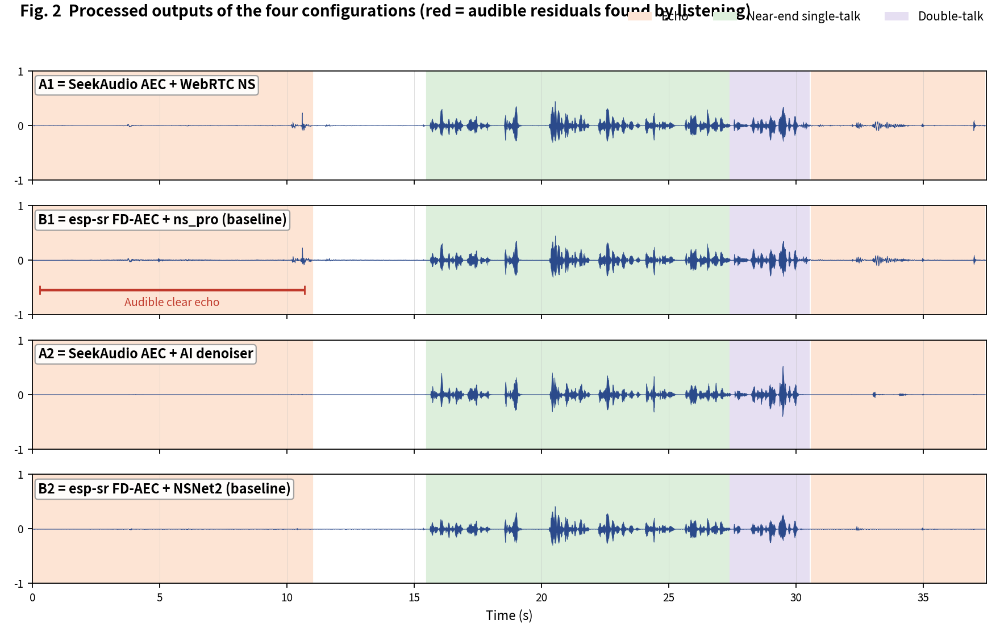
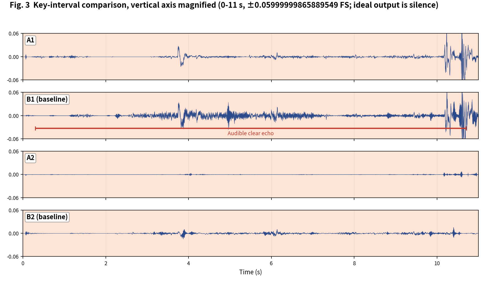

[简体中文](README.md) | English

# SeekAudio AEC Test Case 8

**Two echo segments: an audible gap in the opening span** · measured on ESP32-S3 · subjective + objective evaluation

## 1. Material and scenes

Material from the Microsoft AEC Challenge dataset: near/far are the `_mic.wav` and `_lpb.wav` of `mAVjs9dULk24wBwJUyuzcw_doubletalk_with_movement`. Scene boundaries were annotated by listening:

- **Echo**: 0-11 s, 30.6-37.4 s
- **Near-end single-talk**: 15.5-27.4 s
- **Double-talk**: 27.4-30.5 s

The four configurations match the [main article](../../article/README_EN.md) (A1/B1 share the WebRTC NS tier, A2/B2 share the AI tier - a like-for-like pairing). All outputs were produced on an ESP32-S3 (240 MHz, 16 kHz, 32 ms frames).

**Raw output files of this case** (click to download / listen / view):

| File | Description |
|---|---|
| [near.wav](../../../output_dir/case8/near.wav) / [far.wav](../../../output_dir/case8/far.wav) | Test material (microphone / far-end reference) |
| [a1.wav](../../../output_dir/case8/a1.wav) [b1.wav](../../../output_dir/case8/b1.wav) [a2.wav](../../../output_dir/case8/a2.wav) [b2.wav](../../../output_dir/case8/b2.wav) | The four configurations' outputs on the ESP32-S3 |
| [log.txt](../../../output_dir/case8/log.txt) | Device serial log |
| [aec_report.txt](../../../output_dir/case8/aec_report.txt) / [aec_report_en.txt](../../../output_dir/case8/aec_report_en.txt) | Full automated report (CN / EN) |

## 2. Subjective evaluation: see it, hear it







**Listening verdict (headphones, segment-by-segment A/B; download the WAVs above and verify yourself):**

- **B1**: clearly audible echo across the 0-11 s echo segment, with an equally obvious waveform gap; **A1** shows no clear residual there;
- elsewhere the configs sound similar; **B2 and A2** are also close.

## 3. Objective data

Metrics follow the main article (Microsoft AEC Challenge methodology + AECMOS + ERLE), computed by [aec_report_en.py](../../../tools/aec_report_en.py) automatically; bold marks the winner within each same-tier pair (A1 vs B1, A2 vs B2).

**On-device compute**

| Metric | A1 | A2 | B1 (baseline) | B2 (baseline) |
|---|---|---|---|---|
| CPU load, avg (%) | **26.6** | **36.7** | 58.5 | 71.2 |
| Real-time factor (higher is better) | **3.76×** | **2.72×** | 1.71× | 1.40× |

**Echo suppression and perceptual quality**

| Metric | A1 | A2 | B1 (baseline) | B2 (baseline) |
|---|---|---|---|---|
| FE-ST ERLE (dB, higher is better) | **5.1** | **21.0** | 4.8 | 18.0 |
| Residual echo (dBFS, lower is better) | **-39.9** | **-55.8** | -39.6 | -52.9 |
| NE-ST correlation | **0.992** | 0.874 | 0.991 | **0.986** |
| Path delay (ms) | **64** | 96 | 70 | **64** |
| AECMOS FE-ST Echo | **4.38** | 3.98 | 3.99 | **4.25** |
| AECMOS NE-ST Other | 4.17 | 4.25 | **4.35** | **4.40** |
| AECMOS DT Echo | 4.66 | 4.62 | **4.70** | **4.72** |
| AECMOS DT Other | **4.37** | 3.94 | 4.27 | **4.42** |
| AECMOS composite | **4.40** | 4.20 | 4.33 | **4.45** |

## 4. Analysis and verdict

The audible gap lands on FE-ST Echo: A1 4.38 vs B1 3.99. The echo level here is low (-34.9 dBFS), so absolute ERLE values are small (A1 5.1 vs B1 4.8). To be candid: the overall gap in this case is modest, and the composite is actually highest for B2 (4.45), with B1 at 4.33 - not every one of the ten cases is a blowout, which is exactly why we publish them all.

**Verdict: A1 vs B1 - a narrow A1 win** (the only audible difference plus the FE perception lead); **A2 vs B2 - essentially a draw**, B2 slightly ahead on composite, A2 saving 48% compute.

**Reproducing this case** (build/flash/run per the repo README, save the serial log as log.txt, unpack littlefs, add the AECMOS model to the same folder, then run):

```bash
python aec_report_en.py --echo 0:11,30.6:37.4 --near 15.5:27.4 --dt 27.4:30.5
```

---

*Test conditions: ESP32-S3 @ 240 MHz, 16 kHz, 32 ms/frame; baselines esp-sr v2.4.5, esp-dsp v1.8.0; figures generated by make_figs_v2.py; library baseline is commit `ca75b3d` - later library optimizations are not reflected in this report.*
