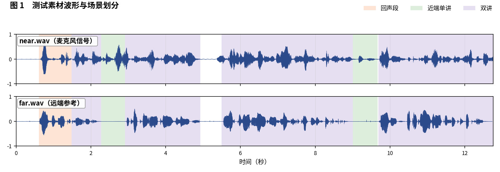
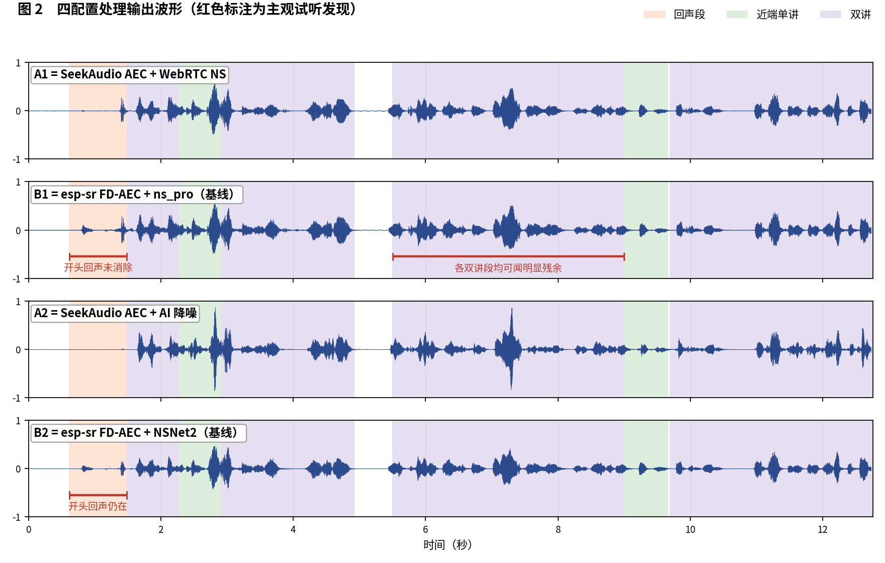
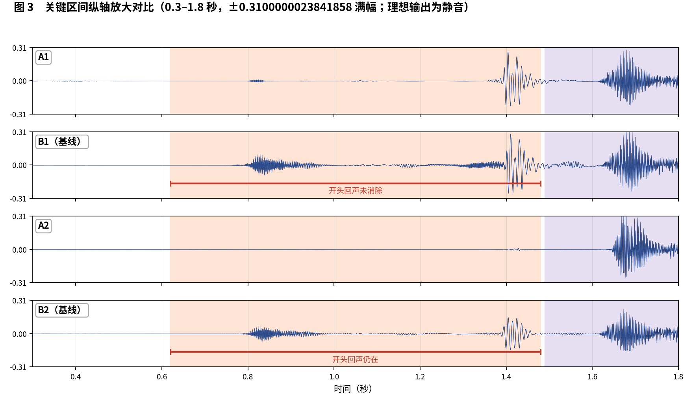

简体中文 | [English](README_EN.md)

# SeekAudio AEC 测试用例 9

**密集交替双讲：本组差距最大的用例之一** · ESP32-S3 实测 · 主观 + 客观双重评估

## 一、素材与场景

素材取自微软 AEC Challenge 数据集：near/far 分别为 `uL3BLytnwEuieb6jpcG9tQ_doubletalk_with_movement` 的 `_mic.wav` 与 `_lpb.wav`（密集交替双讲）。 人工试听标注场景边界如下：

- **回声段**：0.62–1.48 秒
- **近端单讲**：2.27–2.91 秒，9.0–9.66 秒
- **双讲**：1.49–2.27 秒，2.92–4.92 秒，5.5–9.0 秒，9.7–12.76 秒

四个被测配置与[主文章](../../article/README.md)一致（A1/B1 同为 WebRTC NS 降噪档、A2/B2 同为 AI 降噪档，两两对位公平）。四路输出均在 ESP32-S3（240 MHz，16 kHz，32 ms 帧）上实际运行产生。

**本用例原始输出文件**（点击即可下载试听 / 查看）：

| 文件 | 说明 |
|---|---|
| [near.wav](../../../output_dir/case9/near.wav) / [far.wav](../../../output_dir/case9/far.wav) | 测试素材（麦克风 / 远端参考） |
| [a1.wav](../../../output_dir/case9/a1.wav) [b1.wav](../../../output_dir/case9/b1.wav) [a2.wav](../../../output_dir/case9/a2.wav) [b2.wav](../../../output_dir/case9/b2.wav) | 四配置在 ESP32-S3 上的处理输出 |
| [log.txt](../../../output_dir/case9/log.txt) | 设备串口日志 |
| [aec_report.txt](../../../output_dir/case9/aec_report.txt) / [aec_report_en.txt](../../../output_dir/case9/aec_report_en.txt) | 完整自动化报告（中 / 英） |

## 二、主观评估：眼见为实，耳听为实







**试听结论（佩戴耳机逐段对听，欢迎下载上方 wav 亲自验证）：**

- **开头回声段（0.62–1.48 秒）**：B1 没能消掉，**A1 成功消除**；
- **双讲段**：A1 几乎听不到任何残余回声，**B1 在每一个双讲段都能听到明显残余**——本样本 A1 与 B1 的差距非常明显；
- **B2**：借 AI 降噪消掉了双讲残余，但开头那段回声同样没消掉；**A2** 没有这些问题。

## 三、客观数据

指标体系与主文章一致（微软 AEC Challenge 方法 + AECMOS + ERLE），由 [aec_report.py](../../../tools/aec_report.py) 自动生成；加粗表示同档对比（A1 对 B1、A2 对 B2）中的占优方。

**设备端计算性能**

| 指标 | A1 | A2 | B1（基线） | B2（基线） |
|---|---|---|---|---|
| CPU 平均负载（%） | **29.4** | **39.5** | 61.5 | 73.9 |
| 实时率 RTF（越高越好） | **3.40×** | **2.53×** | 1.63× | 1.35× |

**回声抑制与感知质量**

| 指标 | A1 | A2 | B1（基线） | B2（基线） |
|---|---|---|---|---|
| FE-ST ERLE（dB，越高越好） | **11.9** | **42.5** | 10.8 | 14.9 |
| 残余回声（dBFS，越低越好） | **-29.8** | **-60.4** | -28.7 | -32.8 |
| NE-ST 近端相关度 | 0.996 | 0.900 | **0.999** | **0.986** |
| 链路延迟（ms） | **64** | 96 | 70 | **64** |
| AECMOS FE-ST Echo | **4.71** | **4.45** | 4.12 | 4.37 |
| AECMOS NE-ST Other | 3.85 | 3.69 | **3.89** | **3.89** |
| AECMOS DT Echo | **4.68** | **4.65** | 4.22 | 4.63 |
| AECMOS DT Other | **4.34** | 3.89 | 4.27 | **4.36** |
| AECMOS 综合 | **4.40** | 4.17 | 4.13 | **4.32** |

## 四、分析与判定

数据全面呼应听感：FE-ST Echo A1 4.71 对 B1 4.12，DT Echo A1 4.68 对 B1 4.22，成对比较 A1 全项胜。A2 的 ERLE 高达 42.5 dB（残余 −60.4 dBFS），开头段与双讲段双双干净。

**判定：A 组大胜**——A1 对 B1 全项胜且听感差距'非常明显'；A2 对 B2 在抑制深度与双讲回声分上领先（B2 在近端自然度分项略高），伴随 48% 算力节省。

**复现本用例**（按仓库主页 README 完成编译烧写运行，保存串口日志为 log.txt，解包 littlefs 后与 AECMOS 模型放入同一目录，执行）：

```bash
python aec_report.py --echo 0.62:1.48 --near 2.27:2.91,9.0:9.66 --dt 1.49:2.27,2.92:4.92,5.5:9.0,9.7:12.76
```

---

*测试条件：ESP32-S3 @ 240 MHz，16 kHz，32 ms/帧；对比基线 esp-sr v2.4.5、esp-dsp v1.8.0；波形图由 make_figs_v2.py 生成；评测库基线为提交 `ca75b3d`，此后的库优化不体现于本报告。*
