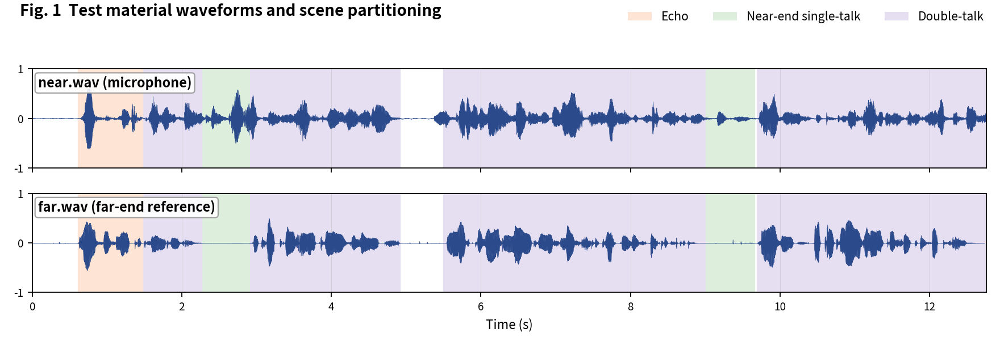
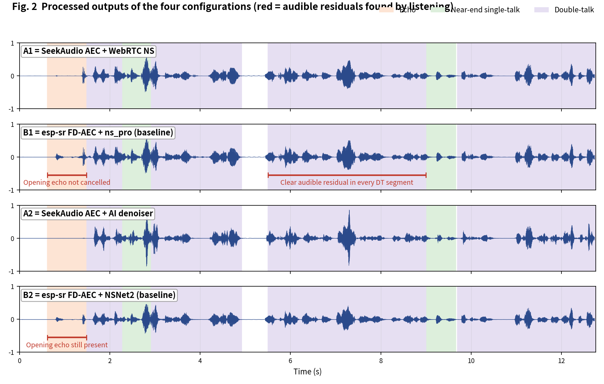
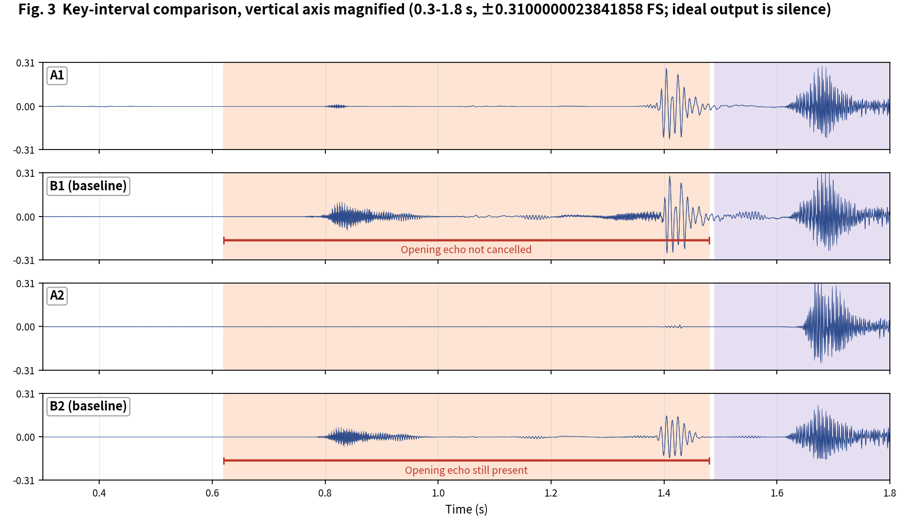

[简体中文](README.md) | English

# SeekAudio AEC Test Case 9

**Dense alternating double-talk: one of the widest gaps in the suite** · measured on ESP32-S3 · subjective + objective evaluation

## 1. Material and scenes

Material from the Microsoft AEC Challenge dataset: near/far are the `_mic.wav` and `_lpb.wav` of `uL3BLytnwEuieb6jpcG9tQ_doubletalk_with_movement` (dense alternating double-talk). Scene boundaries were annotated by listening:

- **Echo**: 0.62-1.48 s
- **Near-end single-talk**: 2.27-2.91 s, 9.0-9.66 s
- **Double-talk**: 1.49-2.27 s, 2.92-4.92 s, 5.5-9.0 s, 9.7-12.76 s

The four configurations match the [main article](../../article/README_EN.md) (A1/B1 share the WebRTC NS tier, A2/B2 share the AI tier - a like-for-like pairing). All outputs were produced on an ESP32-S3 (240 MHz, 16 kHz, 32 ms frames).

**Raw output files of this case** (click to download / listen / view):

| File | Description |
|---|---|
| [near.wav](../../../output_dir/case9/near.wav) / [far.wav](../../../output_dir/case9/far.wav) | Test material (microphone / far-end reference) |
| [a1.wav](../../../output_dir/case9/a1.wav) [b1.wav](../../../output_dir/case9/b1.wav) [a2.wav](../../../output_dir/case9/a2.wav) [b2.wav](../../../output_dir/case9/b2.wav) | The four configurations' outputs on the ESP32-S3 |
| [log.txt](../../../output_dir/case9/log.txt) | Device serial log |
| [aec_report.txt](../../../output_dir/case9/aec_report.txt) / [aec_report_en.txt](../../../output_dir/case9/aec_report_en.txt) | Full automated report (CN / EN) |

## 2. Subjective evaluation: see it, hear it







**Listening verdict (headphones, segment-by-segment A/B; download the WAVs above and verify yourself):**

- **Opening echo (0.62-1.48 s)**: B1 fails to cancel it; **A1 removes it cleanly**;
- **Double-talk**: A1 leaves almost no audible residual anywhere, while **B1 has clearly audible residual in every DT segment** - the A1-vs-B1 gap on this clip is striking;
- **B2**: its AI denoiser cleans up the DT residual but likewise fails on the opening echo; **A2** has none of these problems.

## 3. Objective data

Metrics follow the main article (Microsoft AEC Challenge methodology + AECMOS + ERLE), computed by [aec_report_en.py](../../../tools/aec_report_en.py) automatically; bold marks the winner within each same-tier pair (A1 vs B1, A2 vs B2).

**On-device compute**

| Metric | A1 | A2 | B1 (baseline) | B2 (baseline) |
|---|---|---|---|---|
| CPU load, avg (%) | **29.4** | **39.5** | 61.5 | 73.9 |
| Real-time factor (higher is better) | **3.40×** | **2.53×** | 1.63× | 1.35× |

**Echo suppression and perceptual quality**

| Metric | A1 | A2 | B1 (baseline) | B2 (baseline) |
|---|---|---|---|---|
| FE-ST ERLE (dB, higher is better) | **11.9** | **42.5** | 10.8 | 14.9 |
| Residual echo (dBFS, lower is better) | **-29.8** | **-60.4** | -28.7 | -32.8 |
| NE-ST correlation | 0.996 | 0.900 | **0.999** | **0.986** |
| Path delay (ms) | **64** | 96 | 70 | **64** |
| AECMOS FE-ST Echo | **4.71** | **4.45** | 4.12 | 4.37 |
| AECMOS NE-ST Other | 3.85 | 3.69 | **3.89** | **3.89** |
| AECMOS DT Echo | **4.68** | **4.65** | 4.22 | 4.63 |
| AECMOS DT Other | **4.34** | 3.89 | 4.27 | **4.36** |
| AECMOS composite | **4.40** | 4.17 | 4.13 | **4.32** |

## 4. Analysis and verdict

The data echoes the ears across the board: FE-ST Echo A1 4.71 vs B1 4.12, DT Echo A1 4.68 vs B1 4.22, and A1 wins every row of the paired comparison. A2's ERLE reaches 42.5 dB (residual -60.4 dBFS), clean in both the opening and the DT segments.

**Verdict: a big win for group A** - A1 beats B1 on every row with a subjectively 'striking' gap; A2 leads B2 on suppression depth and DT Echo (B2 slightly ahead on near-end naturalness), with a 48% compute saving.

**Reproducing this case** (build/flash/run per the repo README, save the serial log as log.txt, unpack littlefs, add the AECMOS model to the same folder, then run):

```bash
python aec_report_en.py --echo 0.62:1.48 --near 2.27:2.91,9.0:9.66 --dt 1.49:2.27,2.92:4.92,5.5:9.0,9.7:12.76
```

---

*Test conditions: ESP32-S3 @ 240 MHz, 16 kHz, 32 ms/frame; baselines esp-sr v2.4.5, esp-dsp v1.8.0; figures generated by make_figs_v2.py; library baseline is commit `ca75b3d` - later library optimizations are not reflected in this report.*
